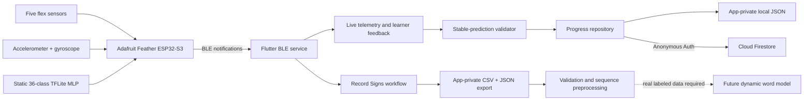
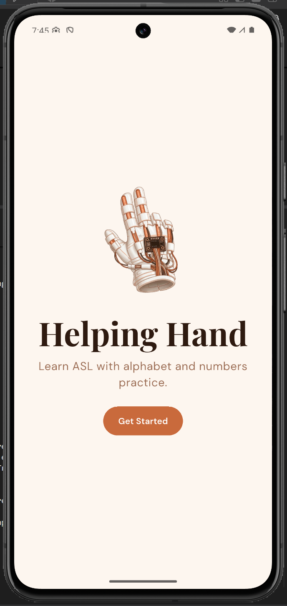
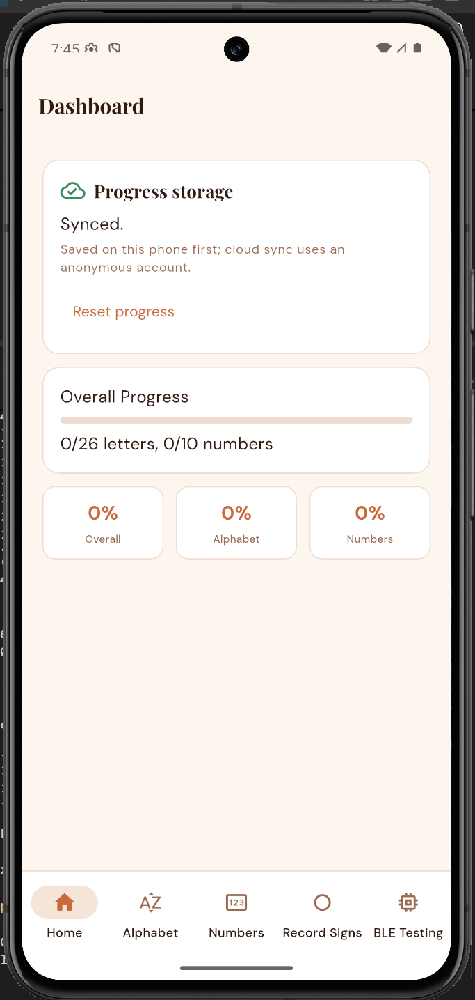
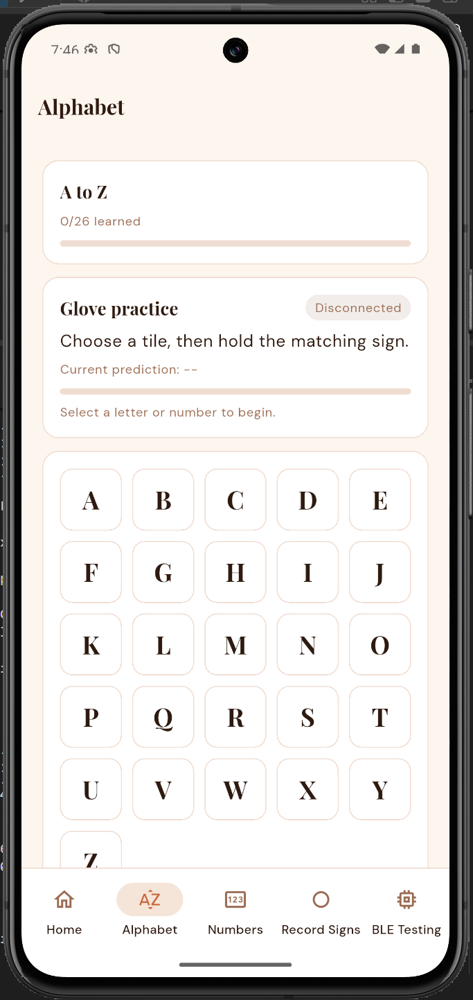
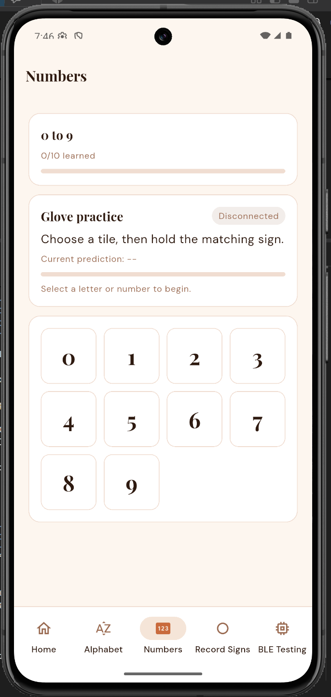
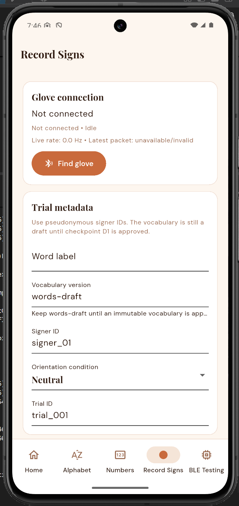
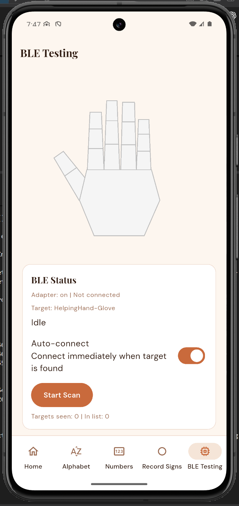
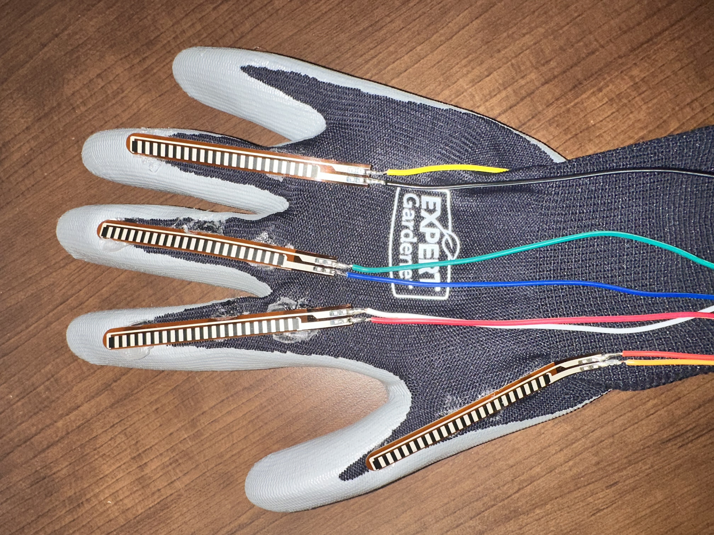

# Helping Hand — M3 Alpha Build

Helping Hand is a wearable-assisted American Sign Language (ASL) learning
system developed for **CEN3908C Senior Design**. A sensor glove captures finger
bend and wrist-motion data, an ESP32 processes the glove signals and sends
telemetry over Bluetooth Low Energy (BLE), and an Android Flutter application
provides live feedback, guided practice, recording tools, and persistent
learner progress.

This repository is the primary submission artifact for the **M3 Alpha Build**.
The alpha demonstrates an integrated vertical slice from physical sensing to
learner feedback and persistent state while preserving the previous static
36-class classifier as the working regression baseline.

- **Repository:** <https://github.com/GG1627/helping-hand>
- **Submission branch:** `main`
- **Validated implementation commit:** [`cce9d38`](https://github.com/GG1627/helping-hand/commit/cce9d3887c5e52fafd4e35753f8e0de516051f79)
- **Android package:** `com.example.flutter_app`
- **Firebase project:** `helping-hand-83137`
- **Team:** Brian, Gael, Kali, and Srinitha

## Alpha build summary

The completed alpha path is:

> Glove sensors → ESP32 static classifier → BLE packets → Flutter learner
> feedback → local progress → authenticated Firestore synchronization

The app also contains a Record Signs workflow and backend foundations for the
next development phase: collecting real, labeled word-level sensor sequences
and training a dynamic recognition model. No real dynamic word model has been
trained, selected, or deployed yet.

### Status at submission

| Area | Alpha status | Evidence and boundary |
| --- | --- | --- |
| ESP32 sensor runtime | Implemented; current source builds | Reads five flex inputs and six accelerometer/gyroscope values and emits structured BLE packets. |
| Static sign classification | Implemented; historically physically validated | The embedded 36-class TFLite MLP predicts `A`–`Z` and `0`–`9` from flex inputs. The team demonstrated glove-to-phone prediction and confidence output at the end of the previous semester. |
| BLE interface | Implemented; historically physically validated | The app scans for `HelpingHand-Glove`, connects, subscribes to notifications, parses packets, and handles disconnect/reconnect states. Historical videos below show physical glove/sensor data reaching the phone. |
| Learner practice | Implemented and automated-test validated | A tile selects a target. Progress is awarded only after a matching prediction at or above 80% confidence remains stable for at least 750 ms and five packets. |
| Persistent progress | Implemented and automated-test validated | Learned letters, learned numbers, and completed exercises are saved locally first and synchronized to Firestore through anonymous authentication. |
| Record Signs | Implemented and automated-test validated | The app labels, records, reviews, discards, saves, and exports app-private CSV/JSON sessions. A new real-device export has not yet been used as model evidence. |
| Word preprocessing | Implemented and automated-test validated | Schema validation, quality reports, fixed-rate resampling, fixed windows, deterministic splits, and train-only standardization are present. |
| Dynamic word models | Architecture foundation only | TCN, CNN-GRU, and CNN-LSTM candidates build and convert in software tests, but none has been trained or evaluated on a real Helping Hand word dataset. |
| Glove haptics | Research/design direction only | Research recommends beginning with small LRA actuators and a closed-loop driver. No haptic circuit, firmware command path, or physical validation exists yet. |

### Assignment traceability

| Alpha requirement | Helping Hand implementation |
| --- | --- |
| Usability and user control | Clearly labeled navigation, BLE scan/connect controls, learner target selection, retry/reset controls, and explicit recording save/discard/export actions. |
| Interface and navigation | Five persistent bottom-navigation destinations: Dashboard, Alphabet, Numbers, Record Signs, and BLE Testing. |
| Perception and feedback | Connection, prediction, confidence, hold progress, success/retry, recording quality, local-save, synchronization, offline, and failure states appear near the action they describe. |
| Responsiveness | BLE and Firebase work is asynchronous. Firebase initialization is lazy and cannot block application launch or local progress access. |
| Build quality and robustness | Flutter analysis, Flutter tests, Android APK build, ESP32 build, and the complete backend test suite pass on the validation environment documented below. |
| Vertical feature | The static learner loop connects physical sensor input, embedded inference, BLE transport, mobile feedback, and persistent learner state. |
| Persistent state | Progress is written to app-private local storage first and optionally synchronized to an authenticated, user-owned Firestore document. |
| Internal processing | The ESP32 performs static TFLite inference; Flutter validates stable predictions; the backend validates and prepares dynamic word sequences. |

## Architecture



### Embedded runtime

The current firmware targets an **Adafruit Feather ESP32-S3** and is located in
[`ESP32/src/main.cpp`](ESP32/src/main.cpp). It:

- reads flex sensors on board aliases `A0` through `A4`;
- initializes the I2C IMU bus using the Feather board definitions (`SDA=3`,
  `SCL=4` in the validated environment);
- probes IMU addresses `0x68` and `0x69` and retries if the device is missing;
- samples five raw flex channels and six IMU channels;
- runs the preserved five-input, 36-output static TFLite classifier;
- sends the predicted label and confidence with each telemetry packet;
- advertises a Nordic UART-style BLE service as `HelpingHand-Glove`; and
- resumes advertising after a disconnect.

The recording stream is configured for 40 Hz by default. This is a configured
target, not a claim that every target phone has measured zero loss at 40 Hz.
Sequence numbers and device timestamps allow delivery rate, gaps, and ordering
to be checked.

### Flutter application

The Android Flutter app is located in [`flutter_app/`](flutter_app/). A shared
BLE service owns scanning, connection, notification subscription, packet
parsing, and reconnect behavior so BLE Testing, learner practice, and Record
Signs consume the same packet stream.

For learner practice, tapping a letter or number selects a target; it does not
mark that item learned. The app requires a stable classifier match before
saving completion. It displays the target, current prediction, confidence,
connection state, hold progress, and understandable success/retry messages.

### Local and Firebase persistence

Progress uses a local-first repository design:

1. The app loads `helping_hand_progress.json` from app-private application
   support storage.
2. Learner progress is written locally before cloud synchronization begins.
3. Firebase initializes on demand rather than before `runApp()`.
4. Firebase Anonymous Authentication provides a per-install user identity.
5. The small progress document synchronizes at
   `users/{uid}/progress/current`.
6. Firestore rules allow an authenticated user to read and write only that
   user's fixed progress document. Collection listing and document deletion
   are denied.
7. If Firebase is unavailable, the app continues with its local copy and offers
   a retry action.

The document contains only schema version, learned letters, learned numbers,
completed exercise identifiers, and an update timestamp. Raw glove recordings
are never uploaded to Firebase.

The UI exposes `loading`, `saved locally`, `syncing`, `synced`,
`offline/local-only`, and failure states. Malformed local state falls back to a
safe empty representation rather than crashing the app.

### Word-recording and ML foundation

Record Signs creates labeled trials using the `word-sequence-v1` contract. Each
saved row retains the exact BLE packet plus parsed timestamps, sequence number,
five flex readings, six IMU readings, word label, pseudonymous signer ID,
orientation condition, and trial metadata. Sessions remain app-private until a
user explicitly opens the Android share sheet to export CSV and JSON files.

The backend can:

- validate required columns, finite values, labels, metadata consistency,
  sequence order, timestamps, rate, and sensor ranges;
- report malformed packets and sequence gaps without repairing raw evidence;
- resample complete trials and create fixed-length windows;
- preserve trial and signer boundaries in deterministic data splits;
- fit standardization using training data only;
- evaluate top-1 accuracy, top-5 accuracy, macro F1, confusion matrices, and
  signer/orientation groups; and
- build and smoke-test TCN, CNN-GRU, and CNN-LSTM candidates with built-in-only
  float TFLite conversion.

Synthetic fixtures are strictly software-test data. They are marked
non-reportable and are not evidence of recognition accuracy. Real dynamic-word
training requires an approved vocabulary and consented, labeled recordings
from multiple signers and wrist orientations.

## Application evidence

The following screenshots were captured from the current Android emulator
build. The glove had been disassembled for the next hardware iteration during
the summer, so the learner, recording, and BLE screenshots intentionally show
the disconnected state. They demonstrate the current interface and navigation,
not a current physical-glove connection. The Dashboard screenshot records the
app reaching its `Synced` progress-storage state.

<table>
  <tr>
    <td align="center"><br><strong>Start</strong></td>
    <td align="center"><br><strong>Dashboard and sync</strong></td>
    <td align="center"><br><strong>Alphabet practice</strong></td>
  </tr>
  <tr>
    <td align="center"><br><strong>Number practice</strong></td>
    <td align="center"><br><strong>Record Signs</strong></td>
    <td align="center"><br><strong>BLE Testing</strong></td>
  </tr>
</table>

### Historical physical integration evidence

These short videos were recorded at the end of the previous development
semester. They establish that real flex-sensor changes reached the physical
Android phone over BLE and changed the live hand visualization. The team's
end-of-semester integration testing also displayed the static classifier's
predicted sign and confidence on the phone.

- [Bench flex sensor streaming to the phone (6 seconds)](app_glove_pictures_and_vids/vid-1.mp4)
- [Wearable glove connected to the phone (8 seconds)](app_glove_pictures_and_vids/vid-2.mp4)

<p align="center">
  
</p>

The videos are historical validation of the glove/BLE baseline. The current
Firebase persistence, stable-prediction completion logic, and Record Signs
workflow were validated through the current automated tests and emulator build;
they were not present in exactly this form in the historical video.

## App navigation and use

### 1. Start and Dashboard

1. Launch the app and select **Get Started**.
2. The Dashboard loads the local progress copy immediately.
3. The Progress storage card reports whether data is loading, saved locally,
   syncing, synced, offline, or failed.
4. **Retry sync** appears when remote synchronization is unavailable.
5. **Reset progress** requires confirmation before clearing progress locally
   and synchronizing the empty state.

### 2. Connect the glove

1. Power the flashed ESP32 glove.
2. Enable Bluetooth and grant the Android permissions requested by the app.
3. Open **BLE Testing** and select **Start Scan**, or select **Find glove** from
   Record Signs.
4. The app targets the advertised name `HelpingHand-Glove` and can auto-connect
   when it appears.
5. A connected status and incoming values indicate a successful notification
   subscription.

### 3. Complete a learner item

1. Open **Alphabet** or **Numbers**.
2. Select one target tile.
3. Form the matching static sign with the connected glove.
4. Hold the matching prediction at 80% confidence or higher for at least
   750 ms and five packets.
5. The interface displays hold progress, `correct`, `try again`, low-confidence,
   and disconnected states near the exercise.
6. After success, the item is marked learned and saved through the progress
   repository.

### 4. Record a word trial

1. Open **Record Signs** and connect the glove.
2. Enter a lowercase word label, vocabulary version, pseudonymous signer ID,
   orientation condition, and unique trial ID.
3. Wait for a complete, fresh packet and select **Start recording**.
4. Perform one complete gesture, then stop and review duration, packet count,
   delivered rate, valid packets, and warnings.
5. Save a clean trial or discard it with a reason.
6. Export the selected session's CSV and JSON through the share sheet.

Use pseudonymous IDs such as `signer_01`. Never enter a participant's name or
email address, upload raw recordings to Firebase, or commit participant
recordings to Git.

## Prerequisites

The alpha was validated on Windows with:

- Git;
- Flutter `3.41.6` stable and Dart `3.11.4`;
- Android Studio/Android SDK and an Android emulator or physical Android phone;
- a Java installation supported by the installed Flutter/Android toolchain;
- Python `3.10.11` for the complete TensorFlow backend suite;
- TensorFlow `2.21.0` and pytest `9.1.1`; and
- PlatformIO Core `6.1.19`.

A physical Android device is required for meaningful BLE validation. An
emulator can validate navigation, local persistence, and Firebase behavior but
does not represent real glove discovery or sensor streaming.

## Clone the repository

```powershell
git clone https://github.com/GG1627/helping-hand.git
cd helping-hand
```

If the repository is private, the project owner must grant the instructors
access before submission.

## Build and run the Flutter app

```powershell
cd flutter_app
flutter pub get
flutter analyze
flutter test
flutter build apk --debug
flutter devices
flutter run -d <android-device-id>
```

The debug APK is generated at:

```text
flutter_app/build/app/outputs/flutter-apk/app-debug.apk
```

The Android Firebase client configuration is already generated for the alpha
project. Running the app does not require a service-account key. Anonymous
authentication is silent; there is no account-entry screen in this alpha.

For project maintainers only, Firestore rules are defined in
[`flutter_app/firestore.rules`](flutter_app/firestore.rules). Always verify the
selected Firebase project before deployment:

```powershell
cd flutter_app
npx firebase-tools use helping-hand-83137
npx firebase-tools use
npx firebase-tools deploy --only firestore --project helping-hand-83137
```

Do not deploy open/test-mode rules, create service-account keys for the mobile
app, or select any unrelated Firebase project.

## Build, upload, and monitor the ESP32 firmware

Install PlatformIO if it is not already available:

```powershell
py -3.10 -m pip install platformio
```

Build the firmware:

```powershell
cd ESP32
platformio run
```

Connect the Feather ESP32-S3, identify its serial port, then upload and monitor:

```powershell
platformio run --target upload --upload-port <COM-port>
platformio device monitor --baud 115200 --port <COM-port>
```

Expected output includes BLE advertising status and telemetry beginning with
`seq=...`, `t_ms=...`, and sensor fields. Hard-coded ML test mode is disabled in
the submitted source; normal packets use live flex readings.

The target recording rate can be changed at compile time to an integer from 25
through 50 Hz with `HH_SENSOR_RATE_HZ`. The default is 40 Hz.

## Set up and test the backend

Create a clean Python 3.10 environment from the repository root:

```powershell
py -3.10 -m venv .venv
.\.venv\Scripts\python.exe -m pip install --upgrade pip
.\.venv\Scripts\python.exe -m pip install -r requirements.txt
.\.venv\Scripts\python.exe -m pytest backend/tests -q
```

Validate a real exported Record Signs session without editing it:

```powershell
.\.venv\Scripts\python.exe backend/prepare_word_sequences.py path/to/trials.csv
```

The model-development entry points are intentionally retained for use only
after the team approves a vocabulary and collects a sufficient real dataset:

```powershell
.\.venv\Scripts\python.exe backend/train_word_models.py --help
.\.venv\Scripts\python.exe backend/evaluate_word_models.py --help
```

See [`backend/data/README.md`](backend/data/README.md) for the schema and
privacy contract and [`backend/models/README.md`](backend/models/README.md) for
the model artifact policy.

## BLE packet contract

The firmware and app share Nordic UART-style service and characteristic UUIDs.
Each complete notification contains a monotonically increasing sequence ID,
device uptime, IMU identity, six motion values, static prediction and
confidence, and five raw/normalized flex readings:

```text
seq=...,t_ms=...,who=0xNN,
ax=...,ay=...,az=...,gx=...,gy=...,gz=...,
expected=...,pred=...,pred_conf=...,
flex0_raw=...,flex0_norm=...,...,flex4_raw=...,flex4_norm=...
```

Malformed notifications are retained by the recording path with their original
packet text and are marked invalid rather than silently repaired.

## Validation results

These commands were run on **September 10, 2026** against implementation commit
`cce9d3887c5e52fafd4e35753f8e0de516051f79`:

| Validation | Result |
| --- | --- |
| `flutter analyze` | Passed — no issues found |
| `flutter test` | Passed — all 16 tests |
| `flutter build apk --debug` | Passed — debug APK produced |
| `platformio run` in `ESP32/` | Passed for `adafruit_feather_esp32s3` |
| ESP32 memory report | 37.6% RAM and 83.9% of configured application flash |
| Complete `pytest backend/tests -q` with TensorFlow installed | Passed — 23 tests; 3 non-failing TFLite interpreter deprecation warnings |
| Firebase environment | Correct alpha project verified; Anonymous Authentication enabled; Firestore available |
| Firestore rules | Deployed and read back; authenticated owner-only fixed progress document; no open/test-mode access |
| Current emulator run | Dashboard reached `Synced`, as shown above |
| Historical physical run | Glove/flex data reached a physical Android phone over BLE and changed the live visualization; static predictions and confidence were demonstrated by the team |

Automated compilation and tests do not substitute for current physical-device
validation. The physical evidence videos correspond to the previous integrated
glove baseline; the glove was unavailable for a repeat run of the exact current
software build at screenshot time.

## Repository layout

| Path | Purpose |
| --- | --- |
| [`ESP32/`](ESP32/) | Feather ESP32-S3 firmware, static model header, and IMU diagnostics |
| [`flutter_app/`](flutter_app/) | Android Flutter application, BLE client, learner loop, recording, local persistence, Firebase sync, and tests |
| [`backend/`](backend/) | Static artifacts, word-sequence validation/preprocessing, untrained sequence-model code, and tests |
| [`docs/`](docs/) | Word-data collection and project documentation |
| [`research/`](research/) | Word-level IMU recognition and haptic-feedback research |
| [`app_glove_pictures_and_vids/`](app_glove_pictures_and_vids/) | Current emulator screenshots and historical physical integration evidence |
| [`hardware_pictures/`](hardware_pictures/) | Assembly and soldering photographs |
| [`design_draft/`](design_draft/) | Original design document, Figma concepts, storyboard, networking diagram, and legacy schematic draft |
| [`PLAN.md`](PLAN.md) | Living dynamic-word implementation plan |
| [`ALPHA_BUILD_PLAN.md`](ALPHA_BUILD_PLAN.md) | Deadline-oriented alpha planning and acceptance checklist |

### Hardware documentation note

The schematic image under `design_draft/schematic/` is retained as the original
design-draft artifact. It depicts an ESP32-C3/LSM9DS1 concept and must not be
treated as the as-built Feather ESP32-S3 wiring diagram. The current firmware
pin contract and hardware photographs are the accurate repository evidence for
the alpha implementation. An updated as-built electrical schematic remains a
documentation task for the next hardware assembly.

## Known limitations and next phase

- The glove was disassembled during the summer, so the exact current alpha
  source has not been physically regression-tested as a complete glove.
- The firmware contains an unlimited USB serial readiness wait at startup;
  standalone boot behavior should be rechecked and the wait bounded if it
  blocks without a serial host.
- Forty hertz is the configured recording target; current phone-side packet
  rate, ordering, loss, and long-notification integrity have not been recorded
  as a formal stress result.
- The exact installed IMU part marking and magnetometer capability are not
  confirmed. `WHO_AM_I=0x70` is compatible with MPU-6500/MPU-9250-class devices
  but does not prove a usable magnetometer.
- The first immutable 6–10-word vocabulary and real labeled multi-signer
  dataset have not been approved or collected.
- No dynamic word model has been trained, benchmarked, quantized, selected, or
  deployed. Synthetic fixtures are not performance evidence.
- Real Record Signs export/share behavior and backend validation should be
  repeated on the reassembled glove and target phone.
- Haptic feedback remains research-only. The preferred LRA direction still
  requires component procurement, driver/circuit integration, power and
  thermal checks, and measurement of IMU interference.
- Packet CRC/checksum protection is not implemented.
- The Android release configuration currently uses debug signing; this alpha
  produces a debug APK rather than a production-store artifact.

The next phase is to reassemble and revalidate the glove, freeze the initial
word vocabulary, collect consented recordings across signers and wrist
orientations, compare orientation preprocessing and model candidates, measure
target-runtime latency, and deploy only a real-data-validated word model. Static
classification remains the regression baseline throughout that work.

## AI-assisted development disclosure

This repository follows the course AI-use policy in
[`ai-policy/AI-USAGE.md`](ai-policy/AI-USAGE.md). Approved generative AI tools
assisted with portions of research, planning, implementation, testing, and
documentation. AI-assisted commits use a `GENAI=Yes` subject and an
`AI-Assisted` trailer so the contribution is visible in version history. The
student team remains responsible for reviewing, understanding, validating, and
presenting all submitted work.
