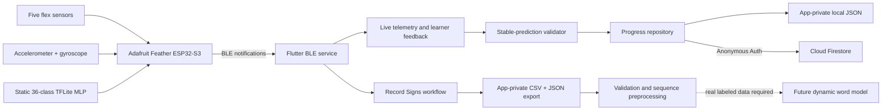
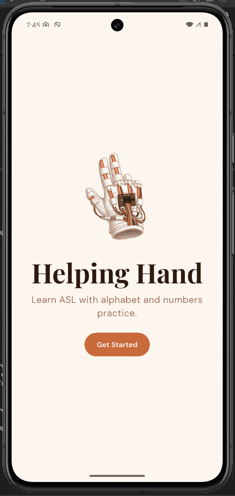
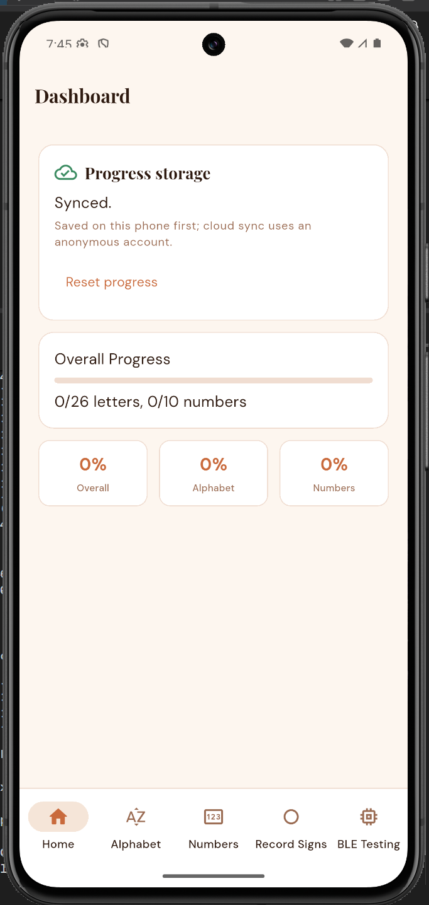
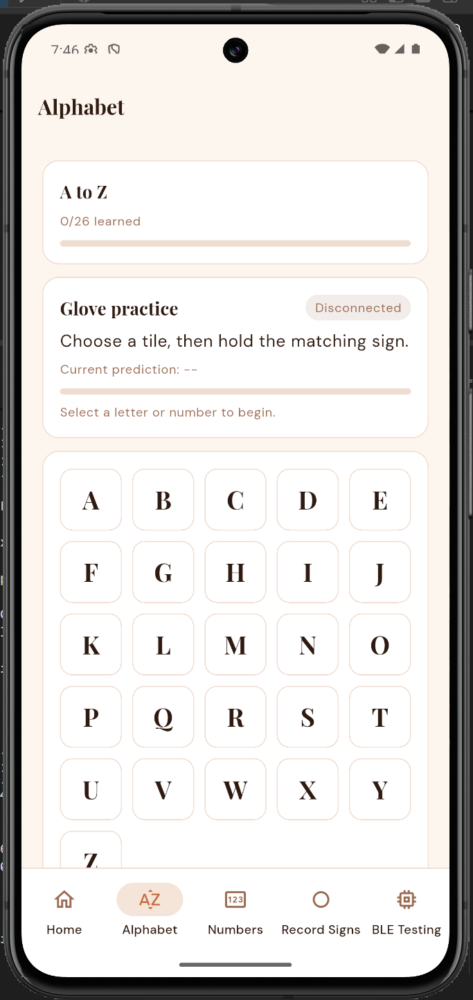
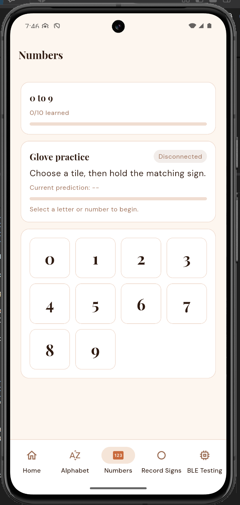
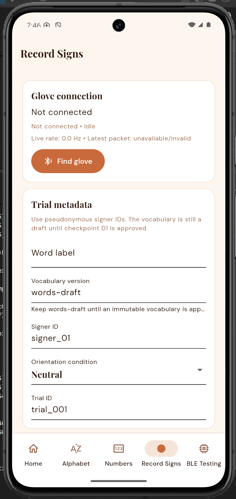
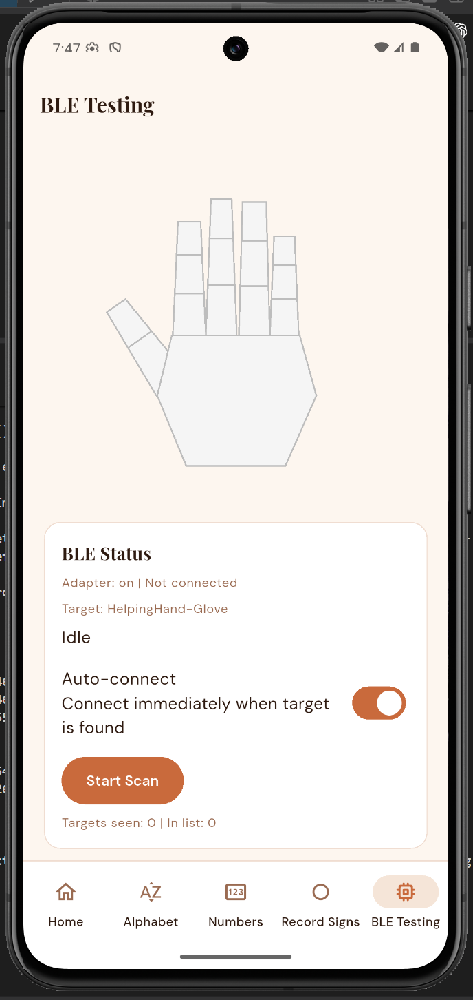
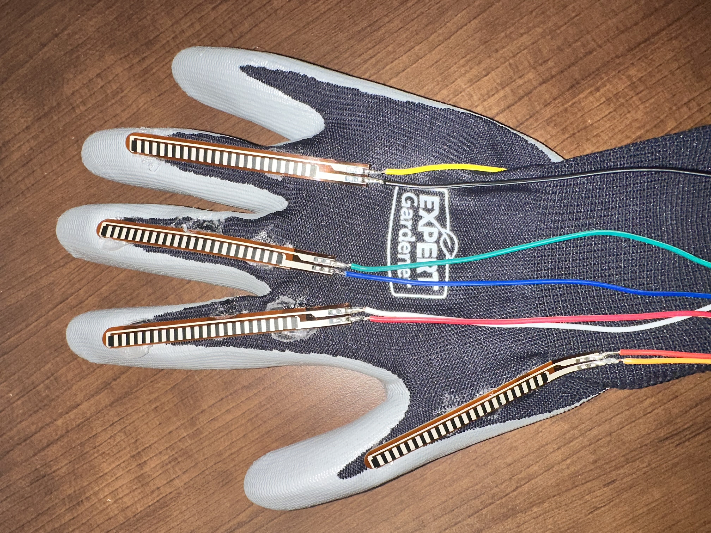

# Helping Hand — M4 Beta Build

Helping Hand is a wearable-assisted American Sign Language (ASL) learning
system developed for **CEN4908C Senior Design**. A sensor glove captures finger
bend and wrist-motion data, an ESP32 processes the glove signals and sends
telemetry over Bluetooth Low Energy (BLE), and an Android Flutter application
provides live feedback, guided practice, recording tools, and persistent
learner progress.

This repository contains the Helping Hand source, hardware documentation, and
evidence for the **M4 Beta Build**. The beta iterates on the M3 integrated
sensor-to-learner path and retains the static 36-class classifier as a
regression baseline while account flows and dedicated practice routes are
refined. The beta is intended for extended testing; this README distinguishes
implemented behavior from features and checks that remain incomplete.

- **Repository:** <https://github.com/GG1627/helping-hand>
- **Current beta application snapshot:** [`d581d19`](https://github.com/GG1627/helping-hand/commit/d581d19)
- **Historical alpha validation commit:** [`cce9d38`](https://github.com/GG1627/helping-hand/commit/cce9d3887c5e52fafd4e35753f8e0de516051f79)
- **Android package:** `com.example.flutter_app`
- **Firebase project:** `helping-hand-83137`
- **Team:** Brian, Gael, Kali, and Srinitha

## Milestone overview

> The alpha details and validation results below refer specifically to commit
> `cce9d38`. Current beta scope and known limitations are summarized here and in
> [`docs/BETA_BUILD_STATUS.md`](docs/BETA_BUILD_STATUS.md). The course prompts
> are preserved in [`M4-Beta-Build.md`](M4-Beta-Build.md) and
> [`T2-Beta-Test-Plan.md`](T2-Beta-Test-Plan.md). The current report and test
> work outline and test plan are [`output/pdf/M4_Beta_Build_Work_Outline.pdf`](output/pdf/M4_Beta_Build_Work_Outline.pdf)
> and [`output/pdf/T2_Beta_Test_Plan.pdf`](output/pdf/T2_Beta_Test_Plan.pdf).

The completed alpha path is:

> Glove sensors → ESP32 static classifier → BLE packets → Flutter learner
> feedback → local progress → authenticated Firestore synchronization

The app also contains a Record Signs workflow and backend foundations for the
next development phase: collecting real, labeled word-level sensor sequences
and training a dynamic recognition model. No real dynamic word model has been
trained, selected, or deployed yet.

### Beta implementation

The current beta development opens directly to sign-in/account creation and
adds Firebase email/password account creation, sign-in, password reset, and
sign-out. Creating an account from the existing
anonymous session links that identity so its cloud progress can be retained.
Local progress files and the Firestore progress document are scoped to the
signed-in Firebase user. The app uses the existing document path
`users/{uid}/progress/current`; Firebase Authentication stores credentials, and
raw glove recordings continue through the CSV/JSON export and team dataset
workflow rather than the progress document.

The team has reported that account creation and sign-in work. The exact app
build/device and cold-restart behavior were not recorded. Cross-account
progress isolation, offline recovery, and cloud progress sync still need
end-to-end validation; see the beta test plan. These beta updates do not change
the historical alpha results documented below.

### Current beta learning flow

The reviewed beta UI now uses text-based Helping Hand branding across login,
signup, and Home, with matching learning-screen styling. Alphabet and Numbers
are target pickers; Words is an active vocabulary picker with no coming-soon
notice. Tapping any letter, number, or word opens a separate live-practice page,
and Back returns to its picker. The grid/list no longer contains practice.

Letters and numbers retain the existing stable-prediction acceptance and
account-scoped progress behavior. Word pages currently provide the practice UI
and glove connection feedback; dynamic word recognition and word completion
are not implemented. The current static model is not used to validate words.

See [Beta build status](docs/BETA_BUILD_STATUS.md),
[Beta app experience](docs/BETA_APP_EXPERIENCE_PLAN.md), and
[Beta test plan](output/pdf/T2_Beta_Test_Plan.pdf). The separate-route change
passed targeted Flutter analysis; device navigation, BLE, Firebase, and
Android beta validation remain Not run. Prior visual/build checks are listed
separately from this route change. Static selection remains active after Back;
see the known-issues section below.

### M4 work and rubric status

| M4 area | Beta implementation | Evidence boundary |
| --- | --- | --- |
| Usability, interface, and navigation | Account screens, styled Home and learning screens, active Alphabet/Numbers/Words pickers, and separate target practice routes with Back. | Route-level targeted analysis exists. Current-device navigation and non-team usability sessions remain Not run. |
| Perception and feedback | Static practice exposes prediction, confidence, hold progress, Retry, and BLE connection state. Account and progress flows expose their current status. | Physical glove feedback on the current beta build remains unverified. |
| Responsiveness | BLE notifications and Firebase work are asynchronous; the learner route observes state owned by the app shell. | Analysis/automated checks do not replace latency measurements on target phone/hardware. |
| Integrated features and persistent state | Existing letter/number static classifier and local-first UID-scoped progress remain; Firebase email/password account flows are present. | Live Firestore isolation, offline recovery, and restart synchronization remain unverified end to end. |
| Build quality and robustness | Existing static-sign path is retained while practice navigation and visual identity are refined. | Full beta regression, edge-case, stress, and current-hardware checks remain Not run. |
| Dynamic word recognition | Word vocabulary pages are navigable; word model inference and word completion are not integrated. | This is an incomplete feature, not a validated recognition capability. |

### Historical alpha feature status

| Area | Alpha status | Evidence and boundary |
| --- | --- | --- |
| ESP32 sensor runtime | Implemented; current source builds | Reads five flex inputs and six accelerometer/gyroscope values and emits structured BLE packets. |
| Static sign classification | Implemented; historically physically validated | The embedded 36-class TFLite MLP predicts `A`–`Z` and `0`–`9` from flex inputs. The team demonstrated glove-to-phone prediction and confidence output at the end of the previous semester. |
| BLE interface | Implemented; historically physically validated | The app scans for `HelpingHand-Glove`, connects, subscribes to notifications, parses packets, and handles disconnect/reconnect states. Historical videos below show physical glove/sensor data reaching the phone. |
| Learner practice | Implemented and automated-test validated | A tile selects a target. Progress is awarded only after a matching prediction at or above 80% confidence remains stable for at least 750 ms and five packets. |
| Persistent progress | Implemented and automated-test validated | Learned letters, learned numbers, and completed exercises are saved locally first and synchronized to Firestore through anonymous authentication. |
| Record Signs | Implemented; pilot physically exercised | The simplified static-sign flow selects a letter/number, counts down for three seconds, records live packets, and saves/exports CSV/JSON. A real-device pilot export is preserved in `backend/recorded_data/`; it is not model evidence because it has one signer and mostly one trial per label. |
| Word preprocessing | Implemented and automated-test validated | Schema validation, quality reports, fixed-rate resampling, fixed windows, deterministic splits, and train-only standardization are present. |
| Dynamic word models | Architecture foundation only | TCN, CNN-GRU, and CNN-LSTM candidates build and convert in software tests, but none has been trained or evaluated on a real Helping Hand word dataset. |
| Glove haptics | Research/design direction only | Research recommends beginning with small LRA actuators and a closed-loop driver. No haptic circuit, firmware command path, or physical validation exists yet. |

### Historical alpha rubric traceability

| Alpha requirement | Helping Hand implementation |
| --- | --- |
| Usability and user control | Clearly labeled navigation, BLE scan/connect controls, learner target selection, retry/reset controls, and explicit recording save/discard/export actions. |
| Interface and navigation | Five persistent bottom-navigation destinations: Dashboard, Alphabet, Numbers, Record Signs, and BLE Testing. |
| Perception and feedback | Connection, prediction, confidence, hold progress, success/retry, recording quality, local-save, synchronization, offline, and failure states appear near the action they describe. |
| Responsiveness | BLE and Firebase work is asynchronous. Firebase initialization is lazy and cannot block application launch or local progress access. |
| Build quality and robustness | Flutter analysis, Flutter tests, Android APK build, ESP32 build, and the complete backend test suite pass on the validation environment documented below. |
| Vertical feature | The static learner loop connects physical sensor input, embedded inference, BLE transport, mobile feedback, and persistent learner state. |
| Persistent state | Progress is written to app-private local storage first and optionally synchronized to an authenticated, user-owned Firestore document. |
| Internal processing | The ESP32 performs static TFLite inference; Flutter validates stable predictions; the backend validates and prepares dynamic word sequences. |

## Architecture


```mermaid
flowchart LR
    FLEX[Five flex sensors] --> ESP[Adafruit Feather ESP32-S3]
    IMU[Accelerometer + gyroscope] --> ESP
    MODEL[Static 36-class TFLite MLP] --> ESP
    ESP -->|BLE notifications| BLE[Flutter BLE service]
    BLE --> LIVE[Live telemetry and learner feedback]
    LIVE --> TRACKER[Stable-prediction validator]
    TRACKER --> PROGRESS[Progress repository]
    PROGRESS --> LOCAL[App-private local JSON]
    PROGRESS -->|Anonymous Auth| FIRESTORE[Cloud Firestore]
    BLE --> RECORD[Record Signs workflow]
    RECORD --> FILES[App-private CSV + JSON export]
    FILES --> BACKEND[Validation and sequence preprocessing]
    BACKEND -. real labeled data required .-> WORDMODEL[Future dynamic word model]
```

### Embedded runtime

The current firmware targets an **Adafruit Feather ESP32-S3** and is located in
[`ESP32/src/main.cpp`](ESP32/src/main.cpp). It:

- reads flex sensors on board aliases `A0` through `A4`;
- initializes the I2C IMU bus using the Feather board definitions (`SDA=3`,
  `SCL=4` in the validated environment);
- probes IMU addresses `0x68` and `0x69` and retries if the device is missing;
- samples five raw flex channels and six IMU channels;
- runs the preserved five-input, 36-output static TFLite classifier;
- sends the predicted label and confidence with each telemetry packet;
- advertises a Nordic UART-style BLE service as `HelpingHand-Glove`; and
- resumes advertising after a disconnect.

The recording stream is configured for 40 Hz by default. This is a configured
target, not a claim that every target phone has measured zero loss at 40 Hz.
Sequence numbers and device timestamps allow delivery rate, gaps, and ordering
to be checked.

### Flutter application

The Android Flutter app is located in [`flutter_app/`](flutter_app/). A shared
BLE service owns scanning, connection, notification subscription, packet
parsing, and reconnect behavior so BLE Testing, learner practice, and Record
Signs consume the same packet stream.

For learner practice, tapping a letter or number selects a target; it does not
mark that item learned. The app requires a stable classifier match before
saving completion. It displays the target, current prediction, confidence,
connection state, hold progress, and understandable success/retry messages.

### Local and Firebase persistence

Progress uses a local-first repository design:

1. The app loads `helping_hand_progress.json` from app-private application
   support storage.
2. Learner progress is written locally before cloud synchronization begins.
3. Firebase initializes on demand rather than before `runApp()`.
4. Firebase Anonymous Authentication provides a per-install user identity.
5. The small progress document synchronizes at
   `users/{uid}/progress/current`.
6. Firestore rules allow an authenticated user to read and write only that
   user's fixed progress document. Collection listing and document deletion
   are denied.
7. If Firebase is unavailable, the app continues with its local copy and offers
   a retry action.

The document contains only schema version, learned letters, learned numbers,
completed exercise identifiers, and an update timestamp. Raw glove recordings
are never uploaded to Firebase.

The UI exposes `loading`, `saved locally`, `syncing`, `synced`,
`offline/local-only`, and failure states. Malformed local state falls back to a
safe empty representation rather than crashing the app.

### Word-recording and ML foundation

Record Signs creates labeled trials using the `word-sequence-v1` contract. Each
saved row retains the exact BLE packet plus parsed timestamps, sequence number,
five flex readings, six IMU readings, word label, pseudonymous signer ID,
orientation condition, and trial metadata. Sessions remain app-private until a
user explicitly opens the Android share sheet to export CSV and JSON files.

The backend can:

- validate required columns, finite values, labels, metadata consistency,
  sequence order, timestamps, rate, and sensor ranges;
- report malformed packets and sequence gaps without repairing raw evidence;
- resample complete trials and create fixed-length windows;
- preserve trial and signer boundaries in deterministic data splits;
- fit standardization using training data only;
- evaluate top-1 accuracy, top-5 accuracy, macro F1, confusion matrices, and
  signer/orientation groups; and
- build and smoke-test TCN, CNN-GRU, and CNN-LSTM candidates with built-in-only
  float TFLite conversion.

Synthetic fixtures are strictly software-test data. They are marked
non-reportable and are not evidence of recognition accuracy. Real dynamic-word
training requires an approved vocabulary and consented, labeled recordings
from multiple signers and wrist orientations.

## Application evidence

The following screenshots were captured from the current Android emulator
build. The glove had been disassembled for the next hardware iteration during
the summer, so the learner, recording, and BLE screenshots intentionally show
the disconnected state. They demonstrate the current interface and navigation,
not a current physical-glove connection. The Dashboard screenshot records the
app reaching its `Synced` progress-storage state.

<table>
  <tr>
    <td align="center"><br><strong>Start</strong></td>
    <td align="center"><br><strong>Dashboard and sync</strong></td>
    <td align="center"><br><strong>Alphabet practice</strong></td>
  </tr>
  <tr>
    <td align="center"><br><strong>Number practice</strong></td>
    <td align="center"><br><strong>Record Signs</strong></td>
    <td align="center"><br><strong>BLE Testing</strong></td>
  </tr>
</table>

### Historical physical integration evidence

These short videos were recorded at the end of the previous development
semester. They establish that real flex-sensor changes reached the physical
Android phone over BLE and changed the live hand visualization. The team's
end-of-semester integration testing also displayed the static classifier's
predicted sign and confidence on the phone.

- [Bench flex sensor streaming to the phone (6 seconds)](app_glove_pictures_and_vids/vid-1.mp4)
- [Wearable glove connected to the phone (8 seconds)](app_glove_pictures_and_vids/vid-2.mp4)

<p align="center">
  
</p>

The videos are historical validation of the glove/BLE baseline. The current
Firebase persistence, stable-prediction completion logic, and Record Signs
workflow were validated through the current automated tests and emulator build;
they were not present in exactly this form in the historical video.

## Beta app navigation and use

### 1. Start and Dashboard

1. Launch the app and create an account or sign in with email and password.
2. Home loads the signed-in user's local progress copy.
3. The Progress storage card reports whether data is loading, saved locally,
   syncing, synced, offline, or failed.
4. **Retry sync** appears when remote synchronization is unavailable.
5. **Reset progress** requires confirmation before clearing progress locally
   and synchronizing the empty state.

### 2. Connect the glove

1. Power the flashed ESP32 glove.
2. Enable Bluetooth and grant the Android permissions requested by the app.
3. Open **BLE Testing** and select **Start Scan**, or select **Find glove** from
   Record Signs.
4. The app targets the advertised name `HelpingHand-Glove` and can auto-connect
   when it appears.
5. A connected status and incoming values indicate a successful notification
   subscription.

### 3. Complete a learner item

1. Open **Alphabet** or **Numbers**.
2. Select one target tile.
3. Form the matching static sign with the connected glove.
4. Hold the matching prediction at 80% confidence or higher for at least
   750 ms and five packets.
5. The interface displays hold progress, `correct`, `try again`, low-confidence,
   and disconnected states near the exercise.
6. After success, the item is marked learned and saved through the progress
   repository.

### 4. Record a word trial

1. Open **Record Signs** and connect the glove.
2. Enter a lowercase word label, vocabulary version, pseudonymous signer ID,
   orientation condition, and unique trial ID.
3. Wait for a complete, fresh packet and select **Start recording**.
4. Perform one complete gesture, then stop and review duration, packet count,
   delivered rate, valid packets, and warnings.
5. Save a clean trial or discard it with a reason.
6. Export the selected session's CSV and JSON through the share sheet.

Use pseudonymous IDs such as `signer_01`. Never enter a participant's name or
email address, upload raw recordings to Firebase, or commit participant
recordings to Git.

## Prerequisites

The documented alpha validation environment on Windows used:

- Git;
- Flutter `3.41.6` stable and Dart `3.11.4`;
- Android Studio/Android SDK and an Android emulator or physical Android phone;
- a Java installation supported by the installed Flutter/Android toolchain;
- Python `3.10.11` for the complete TensorFlow backend suite;
- TensorFlow `2.21.0` and pytest `9.1.1`; and
- PlatformIO Core `6.1.19`.

A physical Android device is required for meaningful BLE validation. An
emulator can validate navigation, local persistence, and Firebase behavior but
does not represent real glove discovery or sensor streaming.

## Clone the repository

```powershell
git clone https://github.com/GG1627/helping-hand.git
cd helping-hand
```

If the repository is private, the project owner must grant the instructors
access before submission.

## Build and run the Flutter app

```powershell
cd flutter_app
flutter pub get
flutter analyze
flutter test
flutter build apk --debug
flutter devices
flutter run -d <android-device-id>
```

The debug APK is generated at:

```text
flutter_app/build/app/outputs/flutter-apk/app-debug.apk
```

The Android Firebase client configuration targets the project listed above.
Running the app does not require a service-account key. Use a team-provided
test account; do not put credentials in this repository. The current beta
provides email/password account creation and sign-in. The older alpha used
anonymous authentication; that historical behavior is not the current account
flow.

For project maintainers only, Firestore rules are defined in
[`flutter_app/firestore.rules`](flutter_app/firestore.rules). Always verify the
selected Firebase project before deployment:

```powershell
cd flutter_app
npx firebase-tools use helping-hand-83137
npx firebase-tools use
npx firebase-tools deploy --only firestore --project helping-hand-83137
```

Do not deploy open/test-mode rules, create service-account keys for the mobile
app, or select any unrelated Firebase project.

## Build, upload, and monitor the ESP32 firmware

Install PlatformIO if it is not already available:

```powershell
py -3.10 -m pip install platformio
```

Build the firmware:

```powershell
cd ESP32
platformio run
```

Connect the Feather ESP32-S3, identify its serial port, then upload and monitor:

```powershell
platformio run --target upload --upload-port <COM-port>
platformio device monitor --baud 115200 --port <COM-port>
```

Expected output includes BLE advertising status and telemetry beginning with
`seq=...`, `t_ms=...`, and sensor fields. Hard-coded ML test mode is disabled in
the submitted source; normal packets use live flex readings.

The target recording rate can be changed at compile time to an integer from 25
through 50 Hz with `HH_SENSOR_RATE_HZ`. The default is 40 Hz.

## Set up and test the backend

Create a clean Python 3.10 environment from the repository root:

```powershell
py -3.10 -m venv .venv
.\.venv\Scripts\python.exe -m pip install --upgrade pip
.\.venv\Scripts\python.exe -m pip install -r requirements.txt
.\.venv\Scripts\python.exe -m pytest backend/tests -q
```

Validate a real exported Record Signs session without editing it:

```powershell
.\.venv\Scripts\python.exe backend/prepare_word_sequences.py path/to/trials.csv
```

The model-development entry points are intentionally retained for use only
after the team approves a vocabulary and collects a sufficient real dataset:

```powershell
.\.venv\Scripts\python.exe backend/train_word_models.py --help
.\.venv\Scripts\python.exe backend/evaluate_word_models.py --help
```

See [`backend/data/README.md`](backend/data/README.md) for the schema and
privacy contract and [`backend/models/README.md`](backend/models/README.md) for
the model artifact policy.

## BLE packet contract

The firmware and app share Nordic UART-style service and characteristic UUIDs.
Each complete notification contains a monotonically increasing sequence ID,
device uptime, IMU identity, six motion values, static prediction and
confidence, and five raw/normalized flex readings:

```text
seq=...,t_ms=...,who=0xNN,
ax=...,ay=...,az=...,gx=...,gy=...,gz=...,
expected=...,pred=...,pred_conf=...,
flex0_raw=...,flex0_norm=...,...,flex4_raw=...,flex4_norm=...
```

Malformed notifications are retained by the recording path with their original
packet text and are marked invalid rather than silently repaired.

## Validation results

These commands were run on **September 10, 2026** against implementation commit
`cce9d3887c5e52fafd4e35753f8e0de516051f79`:

| Validation | Result |
| --- | --- |
| `flutter analyze` | Passed — no issues found |
| `flutter test` | Passed — all 16 tests |
| `flutter build apk --debug` | Passed — debug APK produced |
| `platformio run` in `ESP32/` | Passed for `adafruit_feather_esp32s3` |
| ESP32 memory report | 37.6% RAM and 83.9% of configured application flash |
| Complete `pytest backend/tests -q` with TensorFlow installed | Passed — 23 tests; 3 non-failing TFLite interpreter deprecation warnings |
| Firebase environment | Correct alpha project verified; Anonymous Authentication enabled; Firestore available |
| Firestore rules | Deployed and read back; authenticated owner-only fixed progress document; no open/test-mode access |
| Current emulator run | Dashboard reached `Synced`, as shown above |
| Historical physical run | Glove/flex data reached a physical Android phone over BLE and changed the live visualization; static predictions and confidence were demonstrated by the team |

Automated compilation and tests do not substitute for current physical-device
validation. The physical evidence videos correspond to the previous integrated
glove baseline; the glove was unavailable for a repeat run of the exact current
software build at screenshot time.

## Repository layout

| Path | Purpose |
| --- | --- |
| [`ESP32/`](ESP32/) | Feather ESP32-S3 firmware, static model header, and IMU diagnostics |
| [`flutter_app/`](flutter_app/) | Android Flutter application, BLE client, learner loop, recording, local persistence, Firebase sync, and tests |
| [`backend/`](backend/) | Static artifacts, word-sequence validation/preprocessing, untrained sequence-model code, and tests |
| [`docs/`](docs/) | Word-data collection and project documentation |
| [`research/`](research/) | Word-level IMU recognition and haptic-feedback research |
| [`app_glove_pictures_and_vids/`](app_glove_pictures_and_vids/) | Current emulator screenshots and historical physical integration evidence |
| [`hardware_pictures/`](hardware_pictures/) | Assembly and soldering photographs |
| [`design_draft/`](design_draft/) | Original design document, Figma concepts, storyboard, networking diagram, and legacy schematic draft |
| [`PLAN.md`](PLAN.md) | Living dynamic-word implementation plan |
| [`ALPHA_BUILD_PLAN.md`](ALPHA_BUILD_PLAN.md) | Deadline-oriented alpha planning and acceptance checklist |

### Hardware documentation note

The schematic image under `design_draft/schematic/` is retained as the original
design-draft artifact. It depicts an ESP32-C3/LSM9DS1 concept and must not be
treated as the as-built Feather ESP32-S3 wiring diagram. The current firmware
pin contract and hardware photographs are the accurate repository evidence for
the alpha implementation. An updated as-built electrical schematic remains a
documentation task for the next hardware assembly.

## Known bugs and incomplete beta features

This list separates observed implementation behavior from tests that have not
yet been run. A validation gap is not represented as a confirmed defect. The
separate [beta test plan](output/pdf/T2_Beta_Test_Plan.pdf) defines procedures
for the unrun checks.

| ID | Type | Known behavior and impact | Reproduction / current status |
| --- | --- | --- | --- |
| HH-BUG-01 | Firmware startup | `ESP32/src/main.cpp` waits for the USB `Serial` interface without a timeout. If no serial host opens the port, firmware setup can remain blocked before normal BLE/sensor initialization. | Power the board without opening a serial monitor and observe whether BLE advertising begins. Fix: not implemented; standalone boot needs revalidation. |
| HH-BUG-02 | Practice lifecycle | A selected letter or number remains active after leaving its practice page. The app shell can continue accepting matching packets and may record completion while the learner is back on the picker. | Select a letter/number, return with Back, and continue sending its matching sign. Behavior is confirmed; whether to clear selection on Back is an unresolved product decision. |
| HH-FEAT-01 | Incomplete beta feature | Word pages are navigable but do not perform dynamic word recognition or save word completion. The static character/digit model is not a word recognizer. | Open a word practice page. Word recognition is not integrated; do not claim a recognized word or word progress. |
| HH-FEAT-02 | Incomplete beta feature | Target-specific ASL instructional media is not integrated; practice pages provide a target and generic hold guidance. | Open a target practice page. Review and integration of instruction remain outstanding. |

The following are open validation gates rather than confirmed bugs: current
assembled-glove regression, sustained BLE loss/order/timing, route interaction
on the target Android device, Firebase account isolation and offline recovery,
accessibility checks on-device, and usability sessions with non-team testers.
These checks are **Not run** for the current beta route change. The recording
rate of 40 Hz is a configured target, not a measured phone-side result. The
installed IMU's exact part and magnetometer capability are unconfirmed.

The as-built wiring schematic is also outstanding. The drawing in
`design_draft/schematic/` describes an older ESP32-C3/LSM9DS1 concept and must
not be used as a schematic for the Feather ESP32-S3 glove. Haptic feedback is
research-only; no haptic circuit or firmware control path is integrated. The
Android package currently builds with debug signing, not a store-ready release
signature. Packet CRC/checksum protection is not implemented.

The next phase is to resolve the practice completion lifecycle, test the
assembled glove and account flows, approve a word vocabulary, collect
consented multi-signer recordings across wrist orientations, compare dynamic
model candidates, measure target-runtime latency, and only then integrate a
validated word model. The static classifier remains the regression baseline.

## AI-assisted development disclosure

This repository follows the course AI-use policy in
[`ai-policy/AI-USAGE.md`](ai-policy/AI-USAGE.md). Approved generative AI tools
assisted with portions of research, planning, implementation, testing, and
documentation. AI-assisted commits use a `GENAI=Yes` subject and an
`AI-Assisted` trailer so the contribution is visible in version history. The
student team remains responsible for reviewing, understanding, validating, and
presenting all submitted work.
