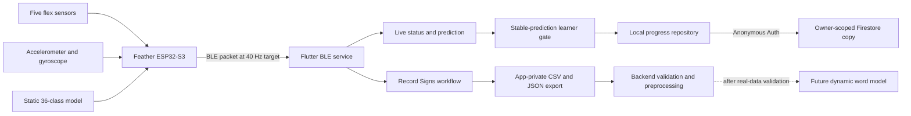
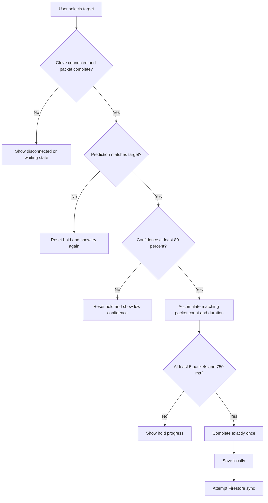
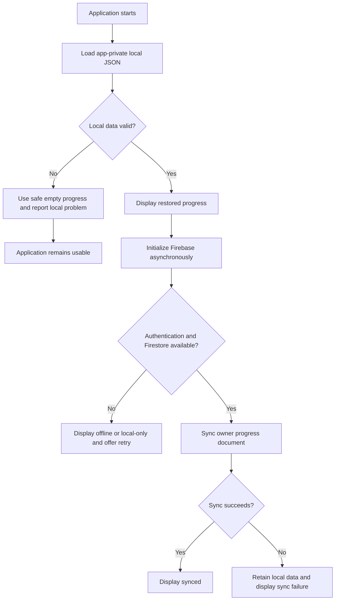

# Helping Hand Alpha Test Plan

**Course:** CEN4908C Senior Design 2, Section 23346  
**Instructor:** Jeremiah Blanchard  
**Assignment:** T1: Alpha Test Plan  
**Project:** Helping Hand  
**Submission date:** September 11, 2026  
**Planned test execution start:** Week of September 13, 2026  
**Document version:** 1.0  

**Team members**

- Gael Garcia
- Kali Schuchhardt
- Brian Paz
- Srinitha Srikanth

**Repository:** <https://github.com/GG1627/helping-hand>  
**Reference build at plan creation:** commit `59e226501a30a735970b7eb3a77eace119ead033`  

> This document is a test plan, not a test-results report. Empty result fields
> are intentional. Every execution must record the exact Git commit, firmware
> configuration, phone/OS version, tester, date, evidence, and observed result.

---

## Document control

| Version | Date | Description | Authors |
| --- | --- | --- | --- |
| 1.0 | September 11, 2026 | Initial reproducible alpha test plan | Helping Hand team |

### Approval record

| Role | Name | Approval/date |
| --- | --- | --- |
| Backend and ML owner | Gael Garcia | Pending |
| Firmware and hardware owner | Kali Schuchhardt | Pending |
| Firmware and hardware owner | Brian Paz | Pending |
| Flutter owner | Srinitha Srikanth | Pending |

## 1. Purpose

This plan defines how the Helping Hand alpha build will be evaluated before
beta development. It is written so that a technical reader outside the team
can reproduce the tests without relying on undocumented team knowledge.

The plan has five objectives:

1. Verify the existing vertical slice from glove sensing through learner
   feedback and persistent progress.
2. measure reliability, timing, packet quality, and failure recovery rather
   than relying only on successful demonstrations.
3. evaluate whether users can discover and operate the primary application
   controls without developer coaching.
4. validate the real word-recording and preprocessing pipeline before using
   participant data to train a dynamic model.
5. define objective gates for comparing dynamic word models and selecting
   either the ESP32-S3 or Flutter application as the eventual inference
   runtime.

Test failures are useful alpha findings. A test must not be changed after
execution merely to turn a failure into a pass. Failed criteria will be logged
as defects, prioritized, corrected where appropriate, and repeated using the
same procedure for beta validation.

## 2. System under test

Helping Hand is a wearable-assisted American Sign Language learning system.
Five flex sensors and an inertial measurement unit (IMU) are connected to an
Adafruit Feather ESP32-S3. The firmware samples the sensors, performs the
preserved static 36-class TensorFlow Lite Micro classification, and transmits
sensor and prediction packets through Bluetooth Low Energy (BLE). A Flutter
Android application displays connection and sensor states, provides alphabet
and number practice, records labeled word trials, and stores learner progress
locally with optional authenticated synchronization to Cloud Firestore.

The backend validates exported word sequences, reports data quality, resamples
complete trials, creates fixed windows, generates signer-aware data splits,
trains sequence-model candidates, and reports evaluation metrics.

### 2.1 Expected end-to-end alpha path



For a Google Docs/PDF submission, render this Mermaid diagram and insert the
rendered image in place of the source block.

### 2.2 Hardware configuration

| Component | Alpha configuration | Information to record at execution |
| --- | --- | --- |
| Microcontroller | Adafruit Feather ESP32-S3 | Board revision and visible markings |
| Finger sensing | Five flex sensors on glove | Sensor model/length if identifiable and finger-to-channel mapping |
| Motion sensing | Six-axis accelerometer/gyroscope runtime; exact part not confirmed | Part marking, I2C address, and reported `WHO_AM_I` value |
| Primary phone | Fairphone Gen 6 | Android 15 |
| Power | Intended glove power source | USB/battery source, voltage, and battery capacity if applicable |
| Network | Wi-Fi or mobile data for Firebase tests | Network type and whether a controlled offline mode was used |

The exact phone OS version must be recorded from **Settings > About phone >
Android version** before physical testing begins.

### 2.3 Software configuration

| Component | Reference environment |
| --- | --- |
| Flutter | 3.41.6 stable |
| Dart | 3.11.4 |
| Python | 3.10.11 |
| TensorFlow | 2.21.0 |
| pytest | 9.1.1 |
| PlatformIO Core | 6.1.19 |
| Android package | `com.example.flutter_app` |
| Firebase project | `helping-hand-83137` only |
| BLE device name | `HelpingHand-Glove` |
| Nominal packet rate | 40 Hz |

The executor may use newer compatible tools but must record all version
differences. Any failure seen only after a tool upgrade must be repeated with
the reference environment before being classified as a product defect.

## 3. Scope and boundaries

### 3.1 Included alpha behaviors

- ESP32-S3 startup, sensor initialization, sensor sampling, and BLE
  advertisement.
- Five flex-sensor readings and six accelerometer/gyroscope readings.
- Preserved static `A`-`Z` and `0`-`9` classifier and confidence output.
- Android BLE discovery, connection, subscription, parsing, disconnect, and
  reconnect behavior.
- Dashboard, Alphabet, Numbers, Record Signs, and BLE Testing navigation.
- Prediction feedback and stable-prediction learner completion.
- Local progress save, restore, malformed-state recovery, and reset.
- Firebase Anonymous Authentication and owner-scoped Firestore progress sync.
- Offline/local-only operation when Firebase is unavailable.
- Record Signs metadata, recording, review, save, discard, and export.
- Backend word-data validation, resampling, windowing, splitting, training,
  evaluation, and TFLite conversion foundations.
- A controlled real-data pilot and subsequent dynamic-model comparison.

### 3.2 Experimental work planned during alpha testing

Dynamic word recognition is not a completed behavior in the submitted alpha
build. The following are test activities to be performed after glove
reassembly, not claims of existing recognition performance:

- SME review and freezing of the initial word vocabulary;
- collection of real labeled sequences from four to five signers;
- training and comparison of TCN, CNN-GRU, and CNN-LSTM candidates;
- user-dependent and signer-independent evaluation;
- orientation-robustness evaluation;
- ESP32-S3 versus Flutter runtime feasibility testing; and
- integration only if a real-data-trained candidate meets the release gates.

### 3.3 Excluded behaviors

- A validated or deployed dynamic word model at the start of this plan.
- Production-store Android release signing.
- Raw participant recording upload to Firebase.
- A production haptic-feedback system.
- Claims that synthetic fixtures represent recognition accuracy.

The team has selected linear resonant actuators (LRAs) as the preferred haptic
technology, but an exact actuator and driver are not selected. No haptic
circuit, firmware control path, power characterization, or physical feedback
test is part of alpha acceptance. Future haptic testing must examine
perceptibility, latency, current draw, temperature, comfort, and vibration
interference with the IMU.

## 4. Roles and participants

### 4.1 Team responsibilities

| Area | Primary owners |
| --- | --- |
| Test-plan control and final review | Entire team |
| Backend and machine learning | Gael Garcia |
| Firmware and glove hardware | Kali Schuchhardt and Brian Paz |
| Flutter application | Srinitha Srikanth and Brian Paz |
| Usability coordination | Kali Schuchhardt and Brian Paz |
| SME coordination and vocabulary approval | Kali Schuchhardt and Brian Paz |

No owner may mark their own failed result as passed without a second team
member reviewing the evidence.

### 4.2 ML data contributors

The target is five signers; the permitted minimum is four. At least one signer
must be outside the development team, and the final held-out test signer must
be external whenever possible.

| Cohort size | Development/training | Validation | Final held-out test |
| --- | ---: | ---: | ---: |
| Preferred: 5 signers | 3 signers | 1 signer | 1 signer |
| Minimum: 4 signers | 2 signers | 1 signer | 1 signer |

The split is assigned by pseudonymous signer ID before model training. No
trial or time window from the validation or test signer may appear in the
training set. If the cohort has only four people, the reduced sample size must
be reported as a limitation and no broad population-generalization claim may
be made.

### 4.3 Usability participants

Recruit three people outside the development team. Team members do not count
as independent usability participants. If an external user also contributes ML
recordings, that person completes usability testing before receiving detailed
training on the application.

Use only pseudonymous identifiers such as `user_01` and `signer_01` in test
records. Do not place names, email addresses, or other direct identifiers in
the application, Firebase, exported datasets, screenshots, or reports.

## 5. Required equipment and preparation

### 5.1 Required items

- Reassembled Helping Hand glove
- Adafruit Feather ESP32-S3 and intended power source
- Five connected flex sensors and installed IMU
- Fairphone Gen 6 and compatible USB cable
- Windows development computer
- Android Studio/SDK, Flutter, Python 3.10, TensorFlow, pytest, and PlatformIO
- Stable network connection plus the ability to disable phone networking
- Stopwatch or a second phone for timing
- Phone screen-recording capability
- Serial log capture at 115200 baud
- Printed or on-screen test sheets
- Simple angle guide or phone inclinometer for repeatable wrist orientation

A multimeter, USB power meter, oscilloscope, or logic analyzer may be used for
diagnosis, but this plan does not require electrical measurements the team has
not confirmed it can perform.

### 5.2 Pre-test configuration

Before each test session:

1. Record the date, location, operator, Git commit, Flutter version, firmware
   build flags, phone model, Android version, and Firebase project ID.
2. Confirm the active Firebase project is exactly `helping-hand-83137` before
   any Firebase inspection or deployment.
3. Verify that production firmware uses live sensors and that hard-coded ML
   test mode is disabled unless the specific test explicitly requires it.
4. Charge or connect the glove and phone to their intended power sources.
5. Inspect the glove for exposed conductors, loose wires, excessive flex-sensor
   bending, and heat damage.
6. Remove unrelated BLE peripherals from the immediate test area when testing
   discovery timing.
7. Start screen recording and serial/log capture when required.
8. Use a new test-record sheet and evidence folder.

### 5.3 Evidence naming

Use the following format:

```text
YYYYMMDD_<test-id>_<run-number>_<device-or-signer-id>.<extension>
```

Example:

```text
20260915_BLE-04_01_phone01.csv
```

Store participant recordings outside Git and Firebase. Store only consented,
privacy-reviewed summaries, aggregate metrics, and non-identifying screenshots
with the project documentation.

## 6. Expected behavior

### 6.1 Expected-behavior catalog

| ID | Expected behavior |
| --- | --- |
| EB-01 | The glove reaches BLE advertising when powered without requiring an attached serial monitor. |
| EB-02 | Each flex channel changes with its corresponding finger, and IMU values change with physical translation/rotation. |
| EB-03 | Firmware emits one parseable packet per sample interval with sequence, time, sensor, prediction, confidence, and flex fields. |
| EB-04 | The static classifier produces a ranked `A`-`Z` or `0`-`9` prediction using live flex readings. |
| EB-05 | The app discovers, connects to, subscribes to, disconnects from, and reconnects to `HelpingHand-Glove` without crashing. |
| EB-06 | Navigation remains available and relevant changes in connection, prediction, recording, and persistence state appear near the affected control. |
| EB-07 | Selecting a learner tile does not award progress. Completion occurs only after a matching prediction at or above 80% confidence remains stable for at least 750 ms and five packets. |
| EB-08 | Progress is written locally first and survives a normal force-stop/relaunch. Malformed local state produces a safe empty state instead of a crash. |
| EB-09 | Firebase failure never prevents launch or local progress. When available, anonymous authentication synchronizes only the signed-in user's progress document. |
| EB-10 | Record Signs accepts controlled metadata, retains incoming packet evidence, reports quality, and supports separate save, discard, and export actions. |
| EB-11 | An unedited valid export is accepted by the backend; malformed data is rejected or flagged without silently rewriting the raw evidence. |
| EB-12 | Dynamic candidates are trained only on real approved data with signer/trial separation and are selected using accuracy, macro F1, orientation behavior, size, compatibility, and latency. |
| EB-13 | Raw participant recordings remain local/private unless the participant-approved export process is deliberately used; they are never synchronized to Firebase. |

### 6.2 Learner decision flow



### 6.3 Persistence decision flow



### 6.4 Recording state chart

| Current state | Allowed input | Expected next state and feedback |
| --- | --- | --- |
| Disconnected | Find glove | Scanning/connecting status appears |
| Connected, incomplete metadata | Start recording | Start remains blocked; invalid field is identified |
| Connected, complete metadata, stale packet | Start recording | Start remains blocked until a complete fresh packet arrives |
| Ready | Start recording | Recording timer and packet count begin |
| Recording | Stop | Review displays duration, packet count, delivered rate, valid packets, and warnings |
| Review | Save | Trial is added to the local saved-session manifest |
| Review | Discard with reason | Trial is excluded from saved data and discard reason is retained |
| Saved session | Export | Android share sheet provides CSV and JSON files |

### 6.5 BLE packet contract

A complete notification is expected to contain:

```text
seq=...,t_ms=...,who=0xNN,
ax=...,ay=...,az=...,gx=...,gy=...,gz=...,
expected=...,pred=...,pred_conf=...,
flex0_raw=...,flex0_norm=...,...,flex4_raw=...,flex4_norm=...
```

Expected constraints:

- `seq` increases monotonically; gaps quantify missing notifications.
- `t_ms` increases monotonically.
- flex raw values remain within the 12-bit ADC range `0..4095`.
- normalized flex values remain within `0.0..1.0`.
- finite accelerometer, gyroscope, and confidence values are present.
- prediction is a supported static label when inference succeeds.
- malformed packets remain identifiable and are not silently changed into
  valid data.

## 7. Measurements and acceptance criteria

| Measurement | Alpha acceptance criterion |
| --- | --- |
| Standalone startup | BLE advertisement appears within 15 seconds in all 5 power-cycle trials without a serial host. |
| BLE discovery | Device appears within 15 seconds in at least 9 of 10 attempts. |
| BLE connection | Connection and notification subscription complete within 10 seconds in at least 9 of 10 attempts after device selection. |
| Reconnection | 3 of 3 forced disconnect/reconnect cycles succeed within 15 seconds each. |
| Ten-minute delivery | At least 95% of the 24,000 expected packets are received; average effective rate is at least 38 Hz. |
| Packet validity | At least 99% of received notifications contain all required parseable fields. |
| Sequence quality | Missing sequence IDs are no more than 5%; no duplicate or decreasing IDs are accepted as normal. |
| Stream stability | Zero app crashes, firmware resets, or unexplained disconnects in ten minutes. |
| Flex response | Each intentional bend changes its mapped raw channel by at least 100 ADC counts and at least five times that channel's resting peak-to-peak noise. |
| Static regression subset | At least 80% top-1 accuracy on a frozen representative subset performed by a practiced signer. |
| Full static characterization | Every one of the 36 labels is tested; overall top-1, macro F1, per-class results, and confusion matrix are reported. Initial real-user target: at least 70% top-1 and 0.65 macro F1. |
| Learner gate | 100% of qualifying matches complete exactly once; 0% of mismatches, low-confidence predictions, or insufficient holds complete. |
| Local restoration | Exact saved state appears within 3 seconds after reopening the app. |
| Online sync | `Synced` appears within 15 seconds on the controlled working network. |
| Offline use | Local progress and navigation remain usable with zero crashes; status clearly indicates local-only/offline operation. |
| Recording export | Every deliberately saved test session produces readable CSV and JSON; discarded trials do not appear as saved training trials. |
| Backend validation | Valid unedited exports produce zero validation errors; injected malformed cases are reported with the correct failure category. |
| UI responsiveness | Navigation feedback appears within 1 second during BLE and Firebase I/O; no Android Application Not Responding event occurs. |
| Usability | At least 80% of all assigned tasks and at least 2 of 3 attempts for every critical task are completed without moderator instruction. Median ease rating is at least 4/5. |
| Dynamic model | On final held-out signer data: at least 70% top-1 accuracy, 0.65 macro F1, and 90% top-5 accuracy for vocabularies larger than five classes. |
| Orientation robustness | Worst tested orientation top-1 accuracy is no more than 15 percentage points below neutral orientation. |
| Runtime latency | Median model inference below 100 ms and 95th percentile below 150 ms on the selected runtime. |
| End-to-end word latency | After a complete inference window is available, the displayed suggestion updates within 300 ms at the 95th percentile. |

The static and dynamic recognition thresholds are release targets, not assumed
results. If they are not met, report the measured metrics and retain the prior
validated baseline rather than lowering the criteria after testing.

## 8. Test execution rules

### 8.1 Result values

Every test receives one result:

- **Pass:** every required criterion was satisfied.
- **Fail:** one or more required criteria were not satisfied.
- **Blocked:** the procedure could not execute because a named prerequisite
  was unavailable. Blocked is not equivalent to passed.
- **Not applicable:** permitted only when the test-plan owner documents why the
  feature is outside the executed build.

### 8.2 Defect severity

| Severity | Definition | Examples |
| --- | --- | --- |
| Critical | Safety, privacy, data loss, or complete inability to use the vertical slice | Exposed conductor, raw participant upload, persistent crash on launch |
| High | A core behavior cannot complete or produces invalid evidence | Cannot connect, progress lost, export corrupt, cross-user Firestore access |
| Medium | Feature completes only with workaround or misses a performance threshold | Slow reconnect, packet loss above limit, unclear failure message |
| Low | Cosmetic or minor consistency problem that does not prevent completion | Alignment, wording, non-blocking visual issue |

No open Critical defect is acceptable for alpha testing with external users.
High defects require owner review and a documented containment or correction
before dependent tests continue.

### 8.3 Stop conditions

Stop the affected test immediately if:

- a device, battery, wire, or actuator becomes unexpectedly hot;
- a wire detaches or conductive material becomes exposed;
- the firmware resets repeatedly;
- participant discomfort occurs;
- personally identifying data is entered or captured;
- raw participant data is about to be uploaded to Firebase or committed to
  Git; or
- continued execution could overwrite the only copy of a recording.

## 9. Detailed test procedures

Each test record must contain: test ID, run number, executor, date/time,
environment, exact commit, inputs, observed values, evidence filenames,
pass/fail/blocked result, defect IDs, and reviewer initials.

### 9.1 Build and automated software tests

#### AB-01 — Flutter static analysis and unit/widget tests

**Verifies:** EB-06 through EB-10  
**Preconditions:** Flutter and Android dependencies are installed; commands
start in `flutter_app/`.

**Procedure**

1. Record `flutter --version` and `dart --version`.
2. Run `flutter pub get`.
3. Run `flutter analyze`.
4. Run `flutter test` without limiting the test path or excluding tests.
5. Save the full console output and record passed, failed, and skipped counts.

**Pass criteria:** Dependency resolution, analysis, and the complete Flutter
test suite exit with code 0; analysis reports no issues; no test is skipped
without an explicit documented reason.

#### AB-02 — Android debug APK build

**Verifies:** application build quality  
**Preconditions:** AB-01 passed; Android SDK and compatible Java runtime are
installed.

**Procedure**

1. From `flutter_app/`, run `flutter build apk --debug`.
2. Confirm that `build/app/outputs/flutter-apk/app-debug.apk` exists.
3. Record file size and SHA-256 hash.
4. Install the APK on the Fairphone Gen 6.
5. Launch it once and confirm the start screen renders.

**Pass criteria:** Build and installation exit successfully; APK exists; the
application opens without a crash.

#### AB-03 — ESP32 firmware build

**Verifies:** EB-01 through EB-04  
**Preconditions:** PlatformIO is installed; commands start in `ESP32/`.

**Procedure**

1. Record `platformio --version`.
2. Run `platformio run`.
3. Save the complete output, including board target and memory report.
4. Confirm the target is `adafruit_feather_esp32s3`.

**Pass criteria:** Build exits with code 0; flash and RAM use do not exceed
their configured limits; no source artifact is missing.

#### AB-04 — Complete backend suite

**Verifies:** EB-11 and model-pipeline foundations of EB-12  
**Preconditions:** Clean Python 3.10 environment with all requirements,
including TensorFlow.

**Procedure**

1. From the repository root, create or activate a clean Python 3.10 virtual
   environment.
2. Run `python -m pip install -r requirements.txt`.
3. Record Python, TensorFlow, and pytest versions.
4. Run `python -m pytest backend/tests -q`.
5. Record all passed, failed, skipped, and warning counts. TensorFlow-dependent
   tests may not be omitted.

**Pass criteria:** The complete suite exits with code 0; no test is silently
excluded; warnings are recorded and reviewed.

#### AB-05 — Malformed-input automated coverage

**Verifies:** EB-03, EB-07, EB-08, EB-10, and EB-11  

**Procedure**

1. Review the collected test list from Flutter and backend test output.
2. Confirm executed cases cover malformed BLE packets, low/mismatching stable
   predictions, malformed stored progress, reset, invalid recording metadata,
   sequence gaps, invalid numeric data, and split leakage.
3. Associate each executed automated case with the applicable behavior ID.

**Pass criteria:** Every listed failure class has at least one executed
automated test. Missing coverage becomes a recorded Medium defect and a test
implementation task before beta.

### 9.2 Hardware and firmware tests

#### HW-01 — Pre-power physical inspection

**Verifies:** safe test readiness  

**Procedure**

1. Disconnect power.
2. Photograph the front and back of the glove.
3. Inspect each flex sensor for sharp folds, cracks, and detached mounting.
4. Trace A0-A4 wiring and record the intended finger-to-channel mapping.
5. Inspect power, ground, I2C, and sensor wires for exposed or loose conductors.
6. Confirm the board and IMU are mechanically secured and do not touch bare
   conductive surfaces.
7. Connect intended power for 60 seconds without wearing the glove and check
   for odor, smoke, resets, or unexpected heating by cautious non-contact
   observation first.

**Pass criteria:** No visible unsafe condition, intermittent power, smoke,
odor, or unexpected heating. Any safety concern is Critical and stops physical
testing.

#### HW-02 — Standalone boot without serial monitor

**Verifies:** EB-01  
**Runs:** 5 independent power cycles

**Procedure**

1. Close all serial-monitor applications and disconnect the data connection
   from the development computer.
2. Remove power for at least 10 seconds.
3. Start a stopwatch when power is restored from the intended standalone
   source.
4. On the Fairphone, scan for `HelpingHand-Glove`.
5. Stop timing when the name appears; record time or timeout at 15 seconds.
6. Repeat for five power cycles.
7. After the standalone trials, attach a serial monitor and retain one normal
   boot log for comparison.

**Pass criteria:** Advertisement is discoverable within 15 seconds in all five
runs without a serial host. A device that waits indefinitely for USB serial
fails this test.

#### HW-03 — Flex-channel response and mapping

**Verifies:** EB-02  

**Procedure**

1. Connect the glove and capture five seconds of data with all fingers in the
   documented resting pose.
2. Calculate the resting mean and peak-to-peak noise for each `flexN_raw`.
3. Bend only the finger assigned to channel 0 through its comfortable range
   five times while holding other fingers still; repeat for channels 1-4.
4. For every bend, record minimum, maximum, direction of change, and the other
   channels' changes.
5. Repeat the complete sequence once after reconnecting the glove.

**Pass criteria:** Every intended channel changes by at least 100 ADC counts
and five times its resting peak-to-peak noise for all five repetitions. Values
remain in `0..4095`. Cross-channel movement and reversed sensors are reported;
an unmapped or nonresponsive channel fails.

#### HW-04 — IMU response and identity

**Verifies:** EB-02  

**Procedure**

1. Record the serial-reported I2C address and `WHO_AM_I` value.
2. Place the glove still and flat for ten seconds.
3. Confirm that the acceleration magnitude is approximately gravity and
   record the measured mean and variation.
4. Rotate the glove positively and negatively about each available axis five
   times, returning to rest between movements.
5. Record peak `gx`, `gy`, and `gz`, their signs, and whether the appropriate
   channel responds.
6. Leave the glove still for another ten seconds and record drift/noise.

**Pass criteria:** The IMU is not reported offline; all values are finite; still
acceleration magnitude remains between 0.8 g and 1.2 g on average; every
intentional rotation produces at least a 20 degrees/second absolute peak in an
appropriate gyro channel and opposite rotations produce opposite signs.

#### HW-05 — Static classifier physical characterization

**Verifies:** EB-04  
**Inputs:** Frozen list of all 36 supported labels and a separately marked
representative subset of at least 10 labels.

**Procedure**

1. Use one practiced signer and one observer.
2. Perform each label five times from a neutral rest pose, holding the final
   handshape for two seconds.
3. Record expected label, predicted label, confidence, and repetition number.
4. Randomize the class order for each repetition block.
5. Generate overall top-1 accuracy, representative-subset accuracy, macro F1,
   per-class accuracy, and a 36-class confusion matrix.
6. Document inherently dynamic or flex-ambiguous classes, including `J`/`Z`,
   without deleting their failures.

**Pass criteria:** Representative-subset top-1 is at least 80%. The complete
36-class results are reported, with an initial target of at least 70% overall
top-1 and 0.65 macro F1. Failure does not authorize presenting historical or
synthetic accuracy as current physical evidence.

### 9.3 BLE and integration tests

#### BLE-01 — Discovery and connection timing

**Verifies:** EB-05  
**Runs:** 10

**Procedure**

1. Start with Bluetooth enabled, app permissions granted, and the glove
   advertising.
2. From BLE Testing, start a scan and start a stopwatch simultaneously.
3. Record discovery time.
4. Select the glove and record time until the UI reports connected/listening
   and a complete packet appears.
5. Disconnect normally, wait ten seconds, and repeat ten times.

**Pass criteria:** At least 9/10 discoveries complete within 15 seconds and at
least 9/10 connections/subscriptions complete within 10 seconds after
selection. No crash or connection to an unrelated device occurs.

#### BLE-02 — Packet completeness and ordering

**Verifies:** EB-03 and EB-05  
**Duration:** 2 minutes

**Procedure**

1. Connect the glove and capture every notification with receive timestamp.
2. Parse each packet using the application parser or exported recording.
3. Count total, complete, malformed, duplicate, decreasing, and missing
   sequence IDs.
4. Confirm all fields in Section 6.5 and their numeric ranges.
5. Compare device-time and receive-time duration.

**Pass criteria:** At least 99% of received packets are complete and parseable;
sequence and device time never decrease; missing IDs remain no more than 5%;
all finite values and flex ranges satisfy the packet contract.

#### BLE-03 — Permission and Bluetooth-off recovery

**Verifies:** EB-05 and EB-06  

**Procedure**

1. Remove the application's Bluetooth permission in Android Settings.
2. Attempt a scan and record the message and available recovery control.
3. Restore permission and verify scanning works without reinstalling the app.
4. Disable Bluetooth while the app is connected.
5. Record the state transition and confirm the app remains navigable.
6. Re-enable Bluetooth and reconnect using visible controls.

**Pass criteria:** The app does not crash or hang; it explains the permission
or Bluetooth problem; it recovers after the setting is restored without
losing progress.

#### BLE-04 — Three disconnect/reconnect cycles

**Verifies:** EB-05  

**Procedure**

1. Begin with a stable connection and visible complete packets.
2. Remove glove power for ten seconds.
3. Confirm the UI indicates disconnection rather than continuing to display
   stale data as live.
4. Restore power and time recovery to connected/listening state.
5. Confirm sequence/timestamp behavior and live values after recovery.
6. Repeat three complete cycles.

**Pass criteria:** All three cycles recover within 15 seconds of restored
advertising, without app restart, crash, duplicate subscription, or frozen
telemetry.

#### BLE-05 — Ten-minute stream stress test

**Verifies:** EB-03, EB-05, and responsiveness  
**Duration:** 10 uninterrupted minutes

**Procedure**

1. Start with a charged phone and stable glove power.
2. Begin packet capture and record the first sequence ID and timestamps.
3. Every two minutes, bend each finger and rotate the wrist so the stream is
   not an idle-only test.
4. Navigate between Dashboard, BLE Testing, Alphabet, Numbers, and Record
   Signs while capture continues.
5. At ten minutes, record the last sequence ID, received count, malformed
   count, missing IDs, disconnects, firmware resets, and application crashes.
6. Calculate expected packets as `40 packets/second x measured seconds` and
   calculate delivery percentage and average effective rate.

**Pass criteria:** At least 95% delivery and 38 Hz average; at least 99%
complete packets; no unexplained disconnect, firmware reset, app crash, or
Android ANR; navigation feedback remains under one second.

### 9.4 Flutter learner and interface tests

#### UI-01 — Navigation and state visibility

**Verifies:** EB-06  

**Procedure**

1. Launch the app from a stopped state and select Get Started.
2. Visit Dashboard, Alphabet, Numbers, Record Signs, and BLE Testing in that
   order and then reverse order.
3. Record whether the selected destination is visually identifiable.
4. While disconnected, attempt the primary action on each glove-dependent
   screen and record the displayed explanation.
5. Connect and repeat, confirming that live status replaces disconnected
   status near the relevant controls.

**Pass criteria:** Every destination is reachable in one bottom-navigation
action; selected destination and state changes are visible; no action silently
fails; no placeholder progress, streak, or activity is presented as real.

#### LL-01 — Selection alone does not award progress

**Verifies:** EB-07  

**Procedure**

1. Reset progress after confirmation.
2. Open Alphabet and select `A`; wait five seconds without a matching glove
   prediction.
3. Open Numbers and select `1`; wait five seconds without a matching glove
   prediction.
4. Return to Dashboard and restart the application.

**Pass criteria:** Neither item is learned or counted solely because its tile
was selected, before or after restart.

#### LL-02 — Stable matching completion

**Verifies:** EB-07 and EB-08  

**Procedure**

1. Select one sign from the frozen, physically reliable regression subset.
2. Produce a matching prediction at or above 80% confidence.
3. Hold until at least five matching packets and at least 750 ms have elapsed.
4. Record displayed hold progression and completion time.
5. Continue holding for two seconds and count completion events.
6. Return to Dashboard and record the progress change.

**Pass criteria:** Hold progress is visible; the item completes only after both
minimums are satisfied; completion is awarded exactly once; progress updates
locally.

#### LL-03 — Rejection boundaries

**Verifies:** EB-07  

**Procedure**

Run each condition five times against the same selected target:

1. matching label at 79.9% confidence for more than 750 ms and five packets;
2. matching label at or above 80% for only four packets;
3. matching label at or above 80% for less than 750 ms;
4. wrong label at high confidence;
5. alternating match/mismatch packets that never form a stable hold; and
6. matching stale packet followed by disconnection.

Automated packet injection may be used for exact threshold values; at least
the mismatch and disconnection cases must also be repeated physically.

**Pass criteria:** Zero false completions across all conditions; hold progress
resets or pauses consistently; the UI identifies low-confidence, retry, or
disconnected state.

#### LL-04 — Completion consistency across navigation

**Verifies:** EB-06 through EB-08  

**Procedure**

1. Complete one letter and one number through LL-02.
2. Navigate through all five destinations three times.
3. Return to both learner screens and Dashboard.
4. Record displayed learned tiles and totals.

**Pass criteria:** The same items and totals appear on every relevant screen;
navigation does not duplicate or remove completion.

### 9.5 Persistence and Firebase tests

#### PS-01 — Local save and full restart restoration

**Verifies:** EB-08  

**Procedure**

1. Disable phone networking to ensure this is a local-storage test.
2. Complete one letter and one number through the learner gate.
3. Record the visible local-only/saved-locally state and progress values.
4. Force-stop the application from Android Settings; do not clear app data.
5. Wait ten seconds and relaunch.
6. Time from Dashboard display until exact progress is visible.

**Pass criteria:** Exact letter, number, and totals return within three seconds;
the app does not require Firebase or display fabricated values.

#### PS-02 — Reset with confirmation

**Verifies:** EB-08 and EB-09  

**Procedure**

1. Begin with nonempty progress.
2. Select Reset progress and cancel the confirmation.
3. Verify data remains unchanged.
4. Select Reset again and confirm.
5. Restart the app and, when online, allow one synchronization attempt.

**Pass criteria:** Cancel preserves all values; confirm clears all values;
empty state survives restart and does not reappear from stale cloud data.

#### PS-03 — Malformed local-state recovery

**Verifies:** EB-08  
**Method:** automated test or debug fixture; do not corrupt a participant's
only real device data.

**Procedure**

1. Provide the repository with invalid JSON, wrong field types, unsupported
   letters/numbers, and an unsupported schema version in separate cases.
2. Load progress for each case.
3. Record the returned state and error/status message.

**Pass criteria:** Every case produces a safe empty/default state without an
uncaught exception, fabricated progress, or deletion of unrelated files.

#### PS-04 — Firebase unavailable fallback

**Verifies:** EB-09  

**Procedure**

1. Force-stop the app, enable airplane mode, and relaunch.
2. Time local progress restoration.
3. Complete a new learner item.
4. Confirm a local-only/offline or sync-failure state is visible.
5. Navigate through the application for two minutes.

**Pass criteria:** App launches, restores and saves local progress, and remains
navigable with zero crashes; no operation waits indefinitely for Firebase.

#### PS-05 — Online synchronization and recovery

**Verifies:** EB-09  

**Procedure**

1. Continue from PS-04 with unsynchronized local progress.
2. Disable airplane mode and connect to the controlled network.
3. Use Retry sync if presented and start timing.
4. Record state transitions and stop when `Synced` appears.
5. Verify the Firestore document at `users/{uid}/progress/current` contains
   only schema version, learned letters, learned numbers, completed exercises,
   and update timestamp.

**Pass criteria:** `Synced` appears within 15 seconds; remote values equal the
local values; no raw sensor or participant-recording field is present.

#### PS-06 — Firestore owner isolation and schema enforcement

**Verifies:** EB-09 and EB-13  
**Method:** Firebase Emulator Suite rules test using two mock authenticated
users and one unauthenticated context. Never test by accessing an unrelated
Firebase project.

**Procedure**

1. Load the repository's `flutter_app/firestore.rules` into a Firestore
   emulator.
2. As authenticated user A, create and read
   `users/A/progress/current` with exactly the allowed schema.
3. As user B, attempt to read, create, update, and delete user A's document.
4. As unauthenticated context, attempt the same operations.
5. As user A, attempt list, delete, extra-field, invalid-letter,
   invalid-number, invalid-exercise, wrong-schema-version, and non-server
   timestamp writes.
6. As user A, update their own document using valid data and server timestamp.
7. Save the complete emulator test output.

**Pass criteria:** Only owner get/create/update with valid schema succeeds. All
cross-user, unauthenticated, list, delete, extra-path, extra-field, invalid
value, and invalid timestamp attempts are denied.

### 9.6 Record Signs and backend tests

#### RS-01 — Metadata and readiness validation

**Verifies:** EB-10  

**Procedure**

1. Open Record Signs while disconnected and attempt to start.
2. Connect the glove but leave each required metadata field blank in turn.
3. Enter invalid uppercase/space-containing word labels, direct personal
   identifiers, duplicate trial IDs, and invalid orientation values in
   separate cases.
4. Enter valid controlled values using the approved vocabulary version,
   pseudonymous signer ID, allowed orientation, and unique trial ID.
5. Attempt to start before and after a fresh complete packet arrives.

**Pass criteria:** Start remains blocked with understandable feedback until
connection, valid metadata, unique trial ID, and fresh complete packet are all
present. Valid metadata reaches Ready state.

#### RS-02 — Real trial save and review

**Verifies:** EB-10  

**Procedure**

1. Use valid pilot metadata and reach Ready.
2. Hold the documented still lead-in for 0.5 seconds.
3. Perform one complete approved sign at natural speed.
4. Hold the still tail for 0.5 seconds and stop recording.
5. Record duration, total packets, valid packets, observed rate, gaps, and
   warnings shown in Review.
6. Save the trial and confirm it appears once in the local manifest.

**Pass criteria:** Review metrics are present; at least 20 valid packets exist;
observed rate remains within the backend's 32-50 Hz warning bounds; metadata is
constant; saved trial appears exactly once.

#### RS-03 — Discard path and reason

**Verifies:** EB-10  

**Procedure**

1. Record a separate validly labeled trial.
2. In Review, select Discard and enter a controlled reason such as
   `wrong sign performed`.
3. Confirm discard.
4. Inspect the session manifest and subsequent export.

**Pass criteria:** The reason is retained in discarded-trial metadata; the
trial is not included among saved training rows; previously saved trials are
unchanged.

#### RS-04 — Export and unedited backend validation

**Verifies:** EB-10, EB-11, and EB-13  

**Procedure**

1. Save at least two valid trials and one discarded trial.
2. Export the session through the Android share sheet.
3. Transfer both CSV and JSON/manifest files to the development computer
   without opening and resaving them.
4. Compute and record SHA-256 hashes immediately after transfer.
5. Run:

   ```powershell
   python backend/prepare_word_sequences.py <path-to-exported-trials.csv> `
     --vocabulary <path-to-approved-vocabulary.txt> `
     --target-rate-hz 40 --window-samples 128 `
     --report-json <quality-report.json>
   ```

6. Compare the report with the application manifest and recording review.

**Pass criteria:** Files are readable; hashes remain unchanged during
validation; saved trial IDs, labels, signer, orientation, counts, and rates
agree; valid trials produce zero validation errors; discarded trial is not
treated as saved training data.

#### RS-05 — Malformed export handling

**Verifies:** EB-11  
**Method:** Copy a valid synthetic fixture or disposable export; never alter
the original participant file.

**Procedure**

Create one separate case for each of the following: missing required column,
non-finite sensor value, inconsistent trial metadata, duplicate sample index,
decreasing device time, sequence gap, invalid label, invalid signer ID, invalid
orientation, and fewer than 20 valid packets. Run the validator on each.

**Pass criteria:** Every defect is reported with its documented category and
trial/row context. The validator does not silently repair the raw input or
present the case as clean.

### 9.7 Dynamic word-data and model tests

These procedures begin only after the glove passes HW-01 through BLE-05 and an
SME approves the vocabulary and signing protocol.

#### ML-01 — Vocabulary freeze and SME review

**Verifies:** controlled prerequisite for EB-12  

**Candidate `words-v1` list:**

1. `hello`
2. `thank_you`
3. `please`
4. `sorry`
5. `yes`
6. `no`
7. `eat`
8. `drink`

**Procedure**

1. Have an ASL SME review whether each candidate is appropriate, distinct,
   culturally/linguistically accurate, and observable by one instrumented
   glove.
2. For each retained word, document dominant hand, starting pose, movement,
   ending pose, repetition convention, and accepted variants.
3. Remove or replace signs whose distinction depends mainly on facial grammar,
   the uninstrumented hand, body location not observable by the sensors, or
   hardware capabilities the glove lacks.
4. Save the exact ordered label list as immutable vocabulary version
   `words-v1`. Any later change creates `words-v2`; it does not overwrite
   `words-v1`.

**Pass criteria:** SME approval, exact label order, written sign protocol, and
version identifier are recorded before participant collection begins.

#### ML-02 — Pilot collection

**Verifies:** EB-10 through EB-13 before full-scale collection  
**Participants:** target 5, minimum 4  
**Orientations:** `neutral`, `pitch_up`, `roll_left`, `yaw_right`  
**Pilot repetitions:** 5 clean trials per word/signer/orientation

For five signers and eight words, the pilot target is:

```text
5 signers x 8 words x 4 orientations x 5 trials = 800 clean trials
```

**Procedure**

1. Assign pseudonymous signer IDs and obtain the required participant consent.
2. Record handedness, glove fit category, session ID, and non-identifying ASL
   experience category.
3. Fit the glove consistently and capture a resting baseline.
4. Demonstrate the frozen sign protocol; allow practice trials that are
   clearly marked and excluded from the dataset.
5. Randomize word order within each orientation block.
6. For every trial, hold still for 0.5 seconds, perform one complete sign, hold
   still for 0.5 seconds, stop, review, and save or discard with a reason.
7. Rest at least two seconds between trials and five minutes after every 40
   trials, or sooner at participant request.
8. Export and validate each session without hand-editing.
9. Record valid/invalid counts by signer, word, orientation, and reason.

**Pass criteria:** Every signer/word/orientation cell has five clean trials;
all accepted trials have at least 20 valid packets, constant metadata,
monotonic sample/device time, and observed rate within 32-50 Hz; no direct
identifier appears; no raw recording is uploaded to Firebase or Git.

#### ML-03 — Full collection gate

**Verifies:** dataset sufficiency for EB-12  
**Target repetitions:** at least 20 clean trials per
word/signer/orientation, including pilot trials that passed unchanged.

For five signers and eight words, the full target is:

```text
5 signers x 8 words x 4 orientations x 20 trials = 3,200 clean trials
```

For four signers, the target is 2,560 clean trials. Split collection into
multiple sessions; do not obtain the entire quota through one fatigued session.

**Procedure**

1. Review ML-02 quality and correct systemic sensor, instruction, metadata, or
   rate defects before expansion.
2. Continue the same frozen protocol until every required cell reaches 20
   clean trials.
3. Do not replace failed trials without retaining the discard reason and
   failure count.
4. Record collection date/session so day-to-day variation is measurable.
5. Freeze dataset version and calculate hashes for every source export and
   split manifest.

**Pass criteria:** Required coverage is complete and balanced; every source
file passes validation; all exclusions have reasons; dataset provenance and
hashes are recorded.

#### ML-04 — Leakage-safe split verification

**Verifies:** EB-12  

**Procedure**

1. Assign signer IDs to training, validation, and final test roles before
   training, using Section 4.2.
2. Generate a trial-level user-dependent split for diagnostic comparison.
3. Generate the primary signer-independent split.
4. Compare manifests programmatically for overlapping session IDs, trial IDs,
   and signer IDs where separation is required.
5. Confirm windows from one complete trial occur in only one split.
6. Fit scaling parameters using training data only.

**Pass criteria:** No trial appears in multiple splits; no validation/test
signer appears in signer-independent training; preprocessing statistics are
fit only on training data; manifests and random seeds are retained.

#### ML-05 — Candidate comparison

**Verifies:** EB-12  
**Candidates:** small 1D CNN/TCN, CNN-GRU, and CNN-LSTM

**Procedure**

1. Train every candidate using the same dataset version, split manifests,
   feature sets, search budget, early-stopping policy, and three documented
   random seeds.
2. Compare raw features with the approved orientation preprocessing using the
   same splits.
3. For every run, retain configuration, seed, training history, model
   parameters, predictions, and excluded-trial report.
4. Report user-dependent and signer-independent top-1, top-5, macro F1,
   per-word precision/recall, confusion matrix, signer groups, and orientation
   groups.
5. Evaluate the final untouched test signer only after model family,
   preprocessing, thresholds, and hyperparameters are frozen.

**Pass criteria:** All three candidates receive comparable evaluation; no
synthetic fixture contributes to reported accuracy; final selected candidate
meets at least 70% held-out top-1, 0.65 macro F1, 90% top-5, and the 15-point
orientation-drop limit. If none passes, no model is deployed and the failure
drives revised data collection/model work.

#### ML-06 — TFLite conversion and numerical agreement

**Verifies:** deployment prerequisite for EB-12  

**Procedure**

1. Export every accuracy-qualified candidate to TFLite with its label map and
   preprocessing metadata.
2. Run the source model and TFLite model on the same frozen representative
   windows from each word and orientation.
3. Compare output shapes, finite values, ranked labels, and score differences.
4. Record TFLite size, operations, conversion warnings, and whether Select
   TensorFlow operations are required.

**Pass criteria:** Built-in-only conversion succeeds; output shape and label
order match; top-1 label agreement is 100% on the comparison set; float-score
differences remain within the documented conversion tolerance. Artifacts
without metadata fail.

#### ML-07 — ESP32-S3 runtime feasibility

**Verifies:** whether EB-12 can run on the glove  

**Procedure**

1. Inspect candidate operations for TensorFlow Lite Micro support.
2. Integrate only an accuracy-qualified candidate in an isolated branch while
   retaining the static baseline.
3. Build and record firmware flash/RAM report and tensor-arena allocation.
4. Run 1,000 fixed-window inferences and record median, 95th-percentile, and
   maximum latency, allocation failures, and resets.
5. Run dynamic inference during a BLE-05 ten-minute 40 Hz stream.
6. Compare packet delivery and firmware stability with the static baseline.

**Pass criteria:** Firmware builds with no unsupported operation; configured
flash remains below 90% and reported static RAM below 80%; tensor allocation
always succeeds; median latency is below 100 ms and 95th percentile below 150
ms; 1,000 runs have zero reset/failure; BLE-05 still passes. Otherwise ESP32
deployment is rejected for this model version.

#### ML-08 — Flutter runtime feasibility

**Verifies:** phone fallback/alternative for EB-12  

**Procedure**

1. Integrate the same model, label map, and preprocessing metadata in an
   isolated Flutter build.
2. Replay the same 1,000 fixed windows used in ML-07 on the Fairphone Gen 6.
3. Record median, 95th-percentile, and maximum inference latency, memory
   failure, UI frame stalls, and crashes.
4. Run inference during the ten-minute BLE stream while navigating the app.
5. Confirm ranked labels match the verified TFLite outputs.

**Pass criteria:** Median latency below 100 ms, 95th percentile below 150 ms,
zero inference failures/crashes, correct label order, and no visible UI stall
longer than one second. Flutter is selected if it passes and ESP32-S3 does not.

#### ML-09 — Runtime selection and end-to-end word suggestion

**Verifies:** completed future dynamic vertical slice  

**Procedure**

1. Compare ML-07 and ML-08 using model accuracy, size, compatibility, latency,
   BLE impact, power implications, maintenance effort, and future haptic needs.
2. Document the decision; do not select a runtime solely because it was the
   original assumption.
3. In the selected runtime, stream a real approved sign and display top-ranked
   word suggestions with confidence.
4. Run ten trials per word across at least two signers not used for threshold
   tuning.
5. Measure from completion of the input window to visible suggestion.

**Pass criteria:** Runtime decision is documented; ML-05 accuracy gates remain
met; 95th-percentile display update is within 300 ms; no static regression
feature is removed; results are labeled experimental until physical testing is
complete.

### 9.8 Usability tests

#### US-01 — External-user task study

**Verifies:** EB-05 through EB-10  
**Participants:** 3 external users  
**Moderator:** Kali Schuchhardt or Brian Paz  
**Observer:** a second team member

**Setup**

- Use the current Fairphone and reassembled glove.
- Begin each participant with reset test progress and the same starting screen.
- Read the same task prompts verbatim.
- Do not point at controls or explain navigation unless the participant asks
  for help. Record every help request.
- If the participant will later provide ML data, run this test first.

**Task prompts**

1. "Start the application and find the screen that summarizes your learning
   progress. Tell us what storage status the app is reporting."
2. "Connect the application to the Helping Hand glove and show us where you can
   see changing sensor information."
3. "Choose an alphabet exercise and use the glove to complete it."
4. "Close the application completely, reopen it, and determine whether your
   completion was saved."
5. "Record one trial for the assigned test word, review it, and save it."
6. "Record a second trial, discard it because the wrong sign was performed,
   and provide a reason."
7. "Export the saved recording so it could be given to the ML developer."
8. During a controlled connection loss: "Recover the glove connection and
   continue."

**Measurements per task**

- completed independently: yes/no;
- completion time;
- wrong selections/errors;
- requests for help;
- observed hesitation longer than ten seconds;
- visible system feedback noticed or missed; and
- comments, without names or direct identifiers.

**Suggested time limits**

| Task | Maximum time before recorded timeout |
| --- | ---: |
| Start and interpret Dashboard | 60 seconds |
| Connect and locate telemetry | 90 seconds |
| Complete learner exercise | 120 seconds |
| Restart and verify persistence | 90 seconds |
| Record/review/save | 180 seconds |
| Discard with reason | 120 seconds |
| Export | 180 seconds |
| Recover connection | 90 seconds |

**Pass criteria:** At least 80% of all tasks complete without moderator
instruction; each critical task (connect, learner completion, save/export, and
reconnect) is completed independently by at least 2/3 participants; zero crash
or unrecoverable data loss occurs.

#### US-02 — Post-task perception questionnaire

After US-01, each participant rates these statements from 1 (strongly
disagree) to 5 (strongly agree):

1. I could tell which screen I was using.
2. I could tell whether the glove was connected.
3. The prediction and confidence feedback were understandable.
4. I understood why an exercise succeeded or did not succeed.
5. I could tell whether progress was saved locally or synchronized.
6. The recording save and discard choices were clear.
7. I could recover from a disconnection.
8. Overall, the application was easy to use.

Ask three open questions:

1. What was the most confusing part?
2. What feedback did you expect but not receive?
3. What is the single most important improvement before beta testing?

**Pass criteria:** Median response to statement 8 is at least 4/5; no statement
has a median below 3/5. Lower results are logged as usability defects with the
associated task observations.

## 10. Test order and dependencies

Execute tests in this order:

1. AB-01 through AB-05: software baseline.
2. HW-01: physical safety gate.
3. AB-03, firmware upload, HW-02 through HW-04: glove bring-up.
4. BLE-01 through BLE-05: transport and stress gate.
5. HW-05 and LL-01 through LL-04: static learner vertical slice.
6. PS-01 through PS-06: local/Firebase persistence.
7. RS-01 through RS-05: real collection/export/validation slice.
8. US-01 and US-02: external-user testing.
9. ML-01 and ML-02: vocabulary and pilot.
10. ML-03 through ML-06: full dataset and model comparison.
11. ML-07 through ML-09: runtime selection and future integration.

Do not collect the full ML dataset if pilot validation fails systematically.
Do not conduct external-user glove tests if HW-01 fails. Do not deploy a word
model if data leakage, real-data accuracy, conversion, or runtime tests fail.

## 11. Traceability matrix

| Expected behavior | Primary verification tests |
| --- | --- |
| EB-01 Standalone advertising | AB-03, HW-02 |
| EB-02 Sensor response | HW-03, HW-04, BLE-05 |
| EB-03 Packet contract | AB-05, BLE-02, BLE-05 |
| EB-04 Static inference | HW-05 |
| EB-05 BLE lifecycle | BLE-01, BLE-03, BLE-04, BLE-05, US-01 |
| EB-06 Interface/navigation feedback | AB-01, UI-01, US-01, US-02 |
| EB-07 Stable learner gate | AB-01, AB-05, LL-01, LL-02, LL-03 |
| EB-08 Local persistence | AB-01, AB-05, LL-04, PS-01, PS-02, PS-03 |
| EB-09 Firebase/offline behavior | PS-04, PS-05, PS-06 |
| EB-10 Record Signs workflow | AB-01, RS-01, RS-02, RS-03, RS-04, US-01 |
| EB-11 Backend validation | AB-04, AB-05, RS-04, RS-05 |
| EB-12 Dynamic model rigor | ML-01 through ML-09 |
| EB-13 Privacy boundary | PS-05, PS-06, RS-04, ML-02, ML-03 |

Every expected behavior has at least one test. Requirements with both automated
and physical implications use both methods.

## 12. Overall alpha acceptance

The current static alpha vertical slice is acceptable for the next testing
phase when:

1. all build and complete automated suites pass;
2. no Critical or unresolved High defect remains in ordinary use;
3. the glove boots standalone and completes BLE discovery, connection,
   packet, reconnect, and ten-minute stress criteria;
4. at least one real letter and one real number complete through sensor-driven
   learner validation;
5. exact progress survives restart without network access;
6. online sync and offline fallback behave visibly and securely;
7. a real trial completes save, discard, export, and unedited backend
   validation; and
8. external usability testing meets the minimum task and perception criteria.

Dynamic word-model acceptance is a separate experimental gate. Failure to
produce a qualified dynamic model does not convert synthetic data into
evidence and does not invalidate the static alpha vertical slice; it becomes a
documented priority for beta development.

Haptic feedback is explicitly not an alpha acceptance condition.

## 13. Results-recording templates

### 13.1 Individual test record

| Field | Value |
| --- | --- |
| Test ID/run | |
| Date/time/time zone | |
| Executor and reviewer | |
| Git commit | |
| Firmware flags | |
| Phone/Android version | |
| Hardware configuration | |
| Input/sign/participant ID | |
| Expected result | |
| Observed quantitative result | |
| Evidence filenames | |
| Result: Pass/Fail/Blocked/N/A | |
| Defect IDs | |
| Notes | |

### 13.2 Defect record

| Field | Value |
| --- | --- |
| Defect ID | |
| Related test ID | |
| Severity | |
| Summary | |
| Reproduction steps | |
| Expected behavior | |
| Observed behavior | |
| Evidence | |
| Owner | |
| Status | Open / fixed / accepted risk |
| Fix commit | |
| Retest result/date | |

### 13.3 Session summary

| Metric | Value |
| --- | --- |
| Planned tests | |
| Passed | |
| Failed | |
| Blocked | |
| Not applicable | |
| Critical defects | |
| High defects | |
| Medium defects | |
| Low defects | |
| Decision and next actions | |

## 14. Risks and limitations

- The glove was disassembled before this plan and must be reassembled before
  current end-to-end physical results can be produced.
- The firmware's current serial-readiness behavior may block standalone boot;
  HW-02 is deliberately a release gate.
- The installed IMU part and magnetometer capability are not confirmed. Yaw
  correction must not be claimed from a six-axis reading alone.
- One instrumented glove cannot directly observe facial grammar, the complete
  movement of an uninstrumented hand, or absolute hand position relative to
  the body.
- Four or five signers form a pilot dataset, not population-level evidence.
- Team-member training data may be more consistent than new-user data; the
  external held-out signer and signer-independent split are therefore
  mandatory.
- The configured 40 Hz rate is not treated as measured performance until
  BLE-02 and BLE-05 are executed.
- Anonymous Firebase identities are installation-specific and are not a
  cross-device account system.
- The existing design-draft schematic does not represent the exact as-built
  Feather ESP32-S3 glove. The execution record must use the actual wiring/pin
  map.
- LRA haptics are a design direction only and cannot be evaluated as current
  user feedback.

## 15. References

- Helping Hand repository: <https://github.com/GG1627/helping-hand>
- Firebase Firestore security rules documentation:
  <https://firebase.google.com/docs/firestore/security/get-started>
- Flutter testing documentation: <https://docs.flutter.dev/testing/overview>
- PlatformIO testing/build documentation: <https://docs.platformio.org/>
- Gallaudet University ASL Connect: <https://gallaudet.edu/asl-connect/>
- Lifeprint introductory ASL concept list:
  <https://www.lifeprint.com/asl101/pages-layout/concepts.htm>

The candidate word list is provisional. ASL SME review takes precedence over
English gloss assumptions or generic online descriptions.

## Appendix A — Pre-execution values to complete

| Item | Required value |
| --- | --- |
| Fairphone Gen 6 Android version | Android 15 |
| Exact alpha execution commit/tag | Pending main-branch test build |
| Exact IMU identity/marking | Pending glove inspection |
| Intended glove power source | Pending reassembly record |
| Final `words-v1` SME approval | Pending |
| Five or four final signer IDs and split roles | Pending consent/recruitment |
| Physical test location | Pending |
| Results/evidence storage location | Pending team approval |

All Appendix A values must be completed before their dependent procedure is
executed. The test methods and acceptance thresholds remain fixed unless a
revision is approved and recorded in Document Control before execution.
